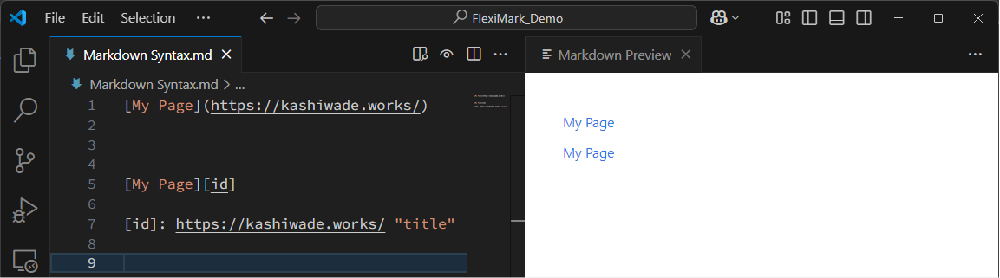
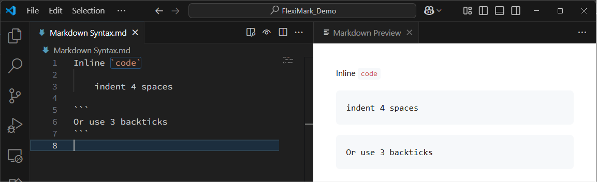

# Basic Markdown Syntax

Introducing the basic Markdown syntax supported by FlexiMark.

## Overview

FlexiMark supports [GitHub Flavored Markdown (GFM)](https://github.github.com/gfm/), an extended specification based on the standard [CommonMark](https://spec.commonmark.org). GFM is the foundation for the Markdown used on GitHub.com and GitHub Enterprise.

:::info

FlexiMark uses [remark-gfm](https://github.com/remarkjs/remark-gfm) for parsing GFM-related Markdown. For more detailed implementation information, please refer to the README.md of [remark-gfm](https://github.com/remarkjs/remark-gfm).

:::

## CommonMark

### Emphasis

```plaintext
*Italics*

_Italics_

**Bold**

__Bold__
```


:::tip

If you want to use asterisks or underscores without making text bold or italic, add a backslash before them.

- `\*`
- `\_`

:::

### Paragraphs

Separate paragraphs with one or more blank lines. To insert a line break within a paragraph, use a backslash `\` or two or more spaces `  `.

```plaintext
Lorem ipsum dolor sit amet, consectetur adipiscing elit. Nulla vel pellentesque justo. Praesent non felis semper, porta ipsum eget, eleifend eros.

Lorem ipsum dolor sit amet, consectetur adipiscing elit. Nulla vel pellentesque justo. Praesent non felis semper, porta ipsum eget, eleifend eros.

Lorem ipsum dolor sit amet, consectetur adipiscing elit.\
Nulla vel pellentesque justo. Praesent non felis semper, porta ipsum eget, eleifend eros.

Lorem ipsum dolor sit amet, consectetur adipiscing elit.  
Nulla vel pellentesque justo. Praesent non felis semper, porta ipsum eget, eleifend eros.
```


:::tip

Line breaks without a backslash `\` or two or more spaces `  ` are ignored.

:::

### Headings

Start a line with a hash (`#`) followed by a space to create a heading. The more hashes you use, the smaller the heading.

```plaintext
# Heading 1

Heading 1
=========

## Heading 2

Heading 2
---------

### Heading 3

#### Heading 4

##### Heading 5

###### Heading 6
```


:::tip

You can optionally add more `#` symbols at the end of the heading. The number does not need to match the beginning.

```plaintext
# Heading 1 #
or
# Heading 1 ##############
```

:::

### Blockquotes

To create a blockquote, start a line with a greater-than symbol (`>`) followed by a space (space is optional). Blockquotes can be nested and can include other formatting.

```plaintext
> First Line
> 
> Another Line
>
> > Nested **Line**
>
> Last Line
```


### Lists

For unordered lists, use an asterisk (`*`), plus (`+`), or hyphen (`-`) as the list marker.  
For ordered lists, use numbers followed by a period (`.`) or closing parenthesis (`)`).

```plaintext
- List item
- List item
- List item

* List item
* List item
* List item

+ List item
+ List item
+ List item

1. First
2. Second
3. Third

1) First
2) Second
3) Third
```


:::tip

For ordered lists, you don't need to increment the numbers.

```plaintext
1. First
1. Second
1. Third
```

:::

### Nested Lists

To nest a list within another, indent each subitem by 2 or 4 spaces. You can also nest paragraphs, blockquotes, and code blocks.

```plaintext
* Item
    1. First Subitem
    2. Second Subitem
* Item
    - Subitem
    - Subitem

* Item
  1. First Subitem
  2. Second Subitem
* Item
  - Subitem
  - Subitem
```


### Links

Links can be embedded directly in text or placed as references at the end. Use square brackets `[]` for the link text, and parentheses `()` for the URL in inline links.

```plaintext
[My Page](https://kashiwade.works/)

[My Page][id]

[id]: https://kashiwade.works/ "title"
```



:::tip

You can write relative links like below:

```plaintext
[Example](/aaa/example.html)
[Example](../bbb/example.md)
```

If the link contains spaces, wrap it in `< >`.

```plaintext
[Example](<../bbb/this is an example.md>)
```

:::

### Images

With VSCode, you can insert images in the following ways:

- If an image is on the clipboard, paste it into the editor with `Ctrl+V`
- Drag and drop the image into the editor while holding `Shift`

```plaintext

```


### Code

To create inline code, wrap the text in backticks (\`).  
To create a code block, indent each line with 4 spaces or wrap the block with three backticks (\`\`\`).

````plaintext
Inline `code`

    indent 4 spaces

```
Or use 3 backticks
```
````



## GFM

### Autolinks

URLs in the text automatically become links.

```plaintext
https://kashiwade.works

Lorem ipsum dolor sit amet, consectetur adipiscing elit. Nulla vel pellentesque justo. Praesent non felis semper, porta ipsum eget, eleifend eros. Maecenas https://kashiwade.works gravida nibh, a rhoncus eros. Nunc ac ante egestas, volutpat ante et, scelerisque quam. Maecenas a tortor odio. Nullam gravida vel sapien sed dignissim. Aenean ex magna, lacinia et metus sed, porta gravida dui. Nunc eget ligula eu magna accumsan rhoncus. Aliquam at pulvinar mauris. In tempor interdum tempor. Nam sit amet dui ex.
```


### Footnotes

You can add footnotes.

```plaintext
Lorem ipsum dolor sit amet, consectetur adipiscing elit. Nulla vel pellentesque justo. Praesent non felis semper, porta ipsum eget, eleifend eros[^alpha]. Maecenas id gravida nibh, a rhoncus eros.

[^alpha]: bravo and charlie.
```


### Strikethrough

You can add strikethrough text.

```plaintext
~strikethrough~
```


### Tables

You can create tables. Complex cell merging is not supported.

```plaintext
| left | center | right |
| :--- | :----: | ----: |
| AAA  |  BBB   |   CCC |
| DDD  |  EEE   |   FFF |
```


### Checklists

You can create TODO lists.

```plaintext
- [ ] task 1
- [x] task 2
- [X] task 3
```

