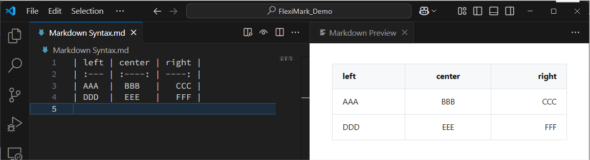

# Markdownの文法（基本）

FlexiMarkがサポートするMarkdownの基本文法を紹介します。

## 概要

FlexiMarkは [GitHub Flavored Markdown (GFM)](https://github.github.com/gfm/) に対応しています。GFMは、標準仕様である[CommonMark](https://spec.commonmark.org)をベースとした拡張仕様で、GitHub.comやGitHub Enterpriseで使われているもののベースとなっています。

:::info

FlexiMarkはGFMに関するMarkdownのパースに[remark-gfm](https://github.com/remarkjs/remark-gfm)を利用しています。GFMのより詳細な実装は、[remark-gfm](https://github.com/remarkjs/remark-gfm)のREADME.mdをご覧ください。

:::

## CommonMark

### 強調

```plaintext
*Italics*

_Italics_

**Bold**

__Bold__
```


:::tip

太字や斜体にせずにアスタリスクやアンダースコアを使いたい場合は、前にバックスラッシュを入力してください。

- `\*`
- `\_`

:::

### 段落

段落の区切りは、1行以上の空白行で明示します。段落内で改行する場合はバックスラッシュ`\`か、半角スペース2つ以上`  `を入力して改行します。

```plaintext
Lorem ipsum dolor sit amet, consectetur adipiscing elit. Nulla vel pellentesque justo. Praesent non felis semper, porta ipsum eget, eleifend eros.

Lorem ipsum dolor sit amet, consectetur adipiscing elit. Nulla vel pellentesque justo. Praesent non felis semper, porta ipsum eget, eleifend eros.

Lorem ipsum dolor sit amet, consectetur adipiscing elit.\
Nulla vel pellentesque justo. Praesent non felis semper, porta ipsum eget, eleifend eros.

Lorem ipsum dolor sit amet, consectetur adipiscing elit.  
Nulla vel pellentesque justo. Praesent non felis semper, porta ipsum eget, eleifend eros.
```


:::tip

バックスラッシュ`\`や2つ以上の半角スペース`  `を伴わない改行は無視されます。

:::

### 見出し

行の先頭にハッシュ（`#`）とスペースを付けると見出しになります。
ハッシュの数が多いほど、見出しは小さくなります。

```plaintext
# Heading 1

Heading 1
=========

## Heading 2

Heading 2
---------

### Heading 3

#### Heading 4

##### Heading 5

###### Heading 6
```


:::tip

オプションで、見出しの終わりにさらに `#` を追加することができます。最初に使った `#` の数と一致させる必要はありません。

```plaintext
# Heading 1 #
or
# Heading 1 ##############
```

:::

### 引用

引用を作成するには、行の先頭に大なり記号（`>`）を付け、その後にスペースを入れます（スペースは任意です）。
引用は入れ子にすることができ、他の書式設定も含めることができます。

```plaintext
> First Line
> 
> Another Line
>
> > Nested **Line**
>
> Last Line
```


### リスト

箇条書きリスト（順不同リスト）は、アスタリスク（`*`）、プラス記号（`+`）、またはハイフン（`-`）のいずれかをリストのマーカーとして使用できます。\
番号付きリスト（順序付きリスト）は、数字の後にピリオド（`.`）または右括弧（`)`）を付けて使用します。

```plaintext
- List item
- List item
- List item

* List item
* List item
* List item

+ List item
+ List item
+ List item

1. First
2. Second
3. Third

1) First
2) Second
3) Third
```


:::tip

順序付きリストについて、数字を1つずつ増加する必要はありません。

```plaintext
1. First
1. Second
1. Third
```

:::

### 入れ子のリスト

1つのリストの中に別のリストを入れ子にするには、副リストの各項目を2つか4つのスペースでインデントします。段落、引用ブロック、コードブロックなどの他の要素も入れ子にすることができます。

```plaintext
* Item
    1. First Subitem
    2. Second Subitem
* Item
    - Subitem
    - Subitem

* Item
  1. First Subitem
  2. Second Subitem
* Item
  - Subitem
  - Subitem
```


### リンク

リンクは、文中に埋め込むことも、文章の末尾に参考文献として配置することもできます。
リンクテキストは角括弧「`[]`」で囲み、インラインリンクの場合はリンクのURLを丸括弧「`()`」で囲みます。

```plaintext
[My Page](https://kashiwade.works/)


[My Page][id]

[id]: https://kashiwade.works/ "title"
```


:::tip

相対パスのリンクは下記のように書けます。

```plaintext
[Example](/aaa/example.html)
[Example](../bbb/example.md)
```

また、リンク内にスペースが存在する際は`< >`で囲みます。

```plaintext
[Example](<../bbb/this is an example.md>)
```

:::

### 画像

VSCodeの機能により下記の操作でも画像の挿入が可能です。

- 画像がクリップボードにある場合はVSCode上で`Ctrl+V`
- `Shift`キーを押しながら画像をVSCodeのテキストエディタ上にドラッグ&ドロップ

```plaintext

```


### コード

インラインコードを作成するには、バッククォート（ \` ）で囲みます。\
コードブロックを作成するには、各行を4つのスペースでインデントするか、コードブロックの上下に3つのバッククォート（\`\`\`）を配置します。

````plaintext
Inline `code`

    indent 4 spaces

```
Or use 3 backticks
```
````


## GFM

### 自動リンク

文中のURLは自動でリンクになります。

```plaintext
https://kashiwade.works

Lorem ipsum dolor sit amet, consectetur adipiscing elit. Nulla vel pellentesque justo. Praesent non felis semper, porta ipsum eget, eleifend eros. Maecenas https://kashiwade.works gravida nibh, a rhoncus eros. Nunc ac ante egestas, volutpat ante et, scelerisque quam. Maecenas a tortor odio. Nullam gravida vel sapien sed dignissim. Aenean ex magna, lacinia et metus sed, porta gravida dui. Nunc eget ligula eu magna accumsan rhoncus. Aliquam at pulvinar mauris. In tempor interdum tempor. Nam sit amet dui ex.
```


### 脚注

脚注を付けることができます。

```plaintext
Lorem ipsum dolor sit amet, consectetur adipiscing elit. Nulla vel pellentesque justo. Praesent non felis semper, porta ipsum eget, eleifend eros[^alpha]. Maecenas id gravida nibh, a rhoncus eros.

[^alpha]: bravo and charlie.
```


### 打ち消し線

打ち消し線を引くことができます。

```plaintext
~strikethrough~
```


### 表

表を書くことができます。但し、複雑な結合などはできません。

```plaintext
| left | center | right |
| :--- | :----: | ----: |
| AAA  |  BBB   |   CCC |
| DDD  |  EEE   |   FFF |
```



### チェックリスト

TODOリストを作れます。

```plaintext
- [ ] task 1
- [x] task 2
- [X] task 3
```

