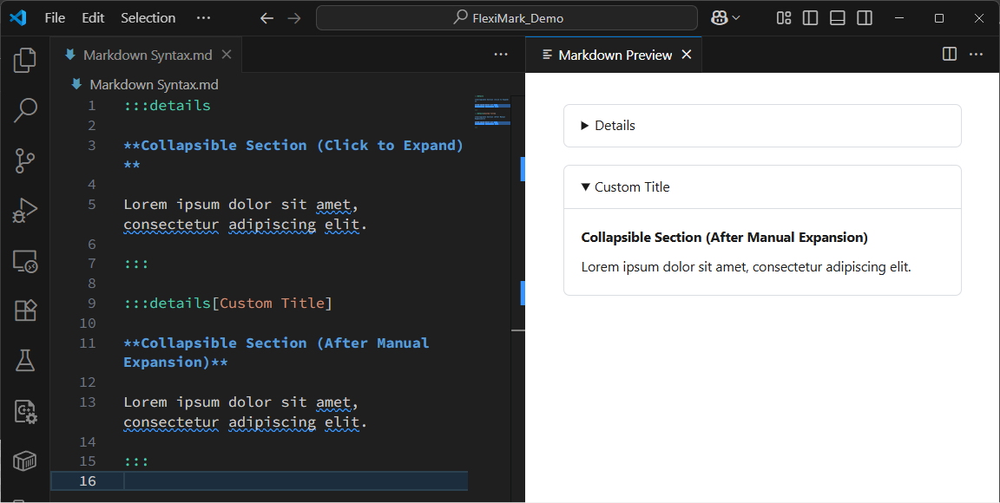
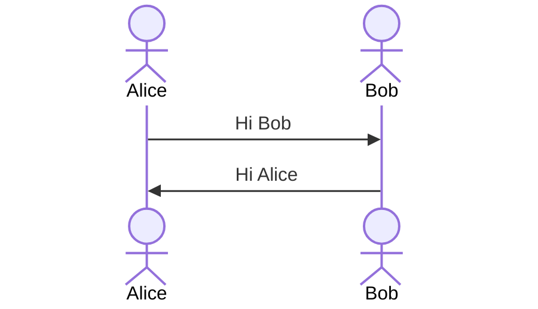
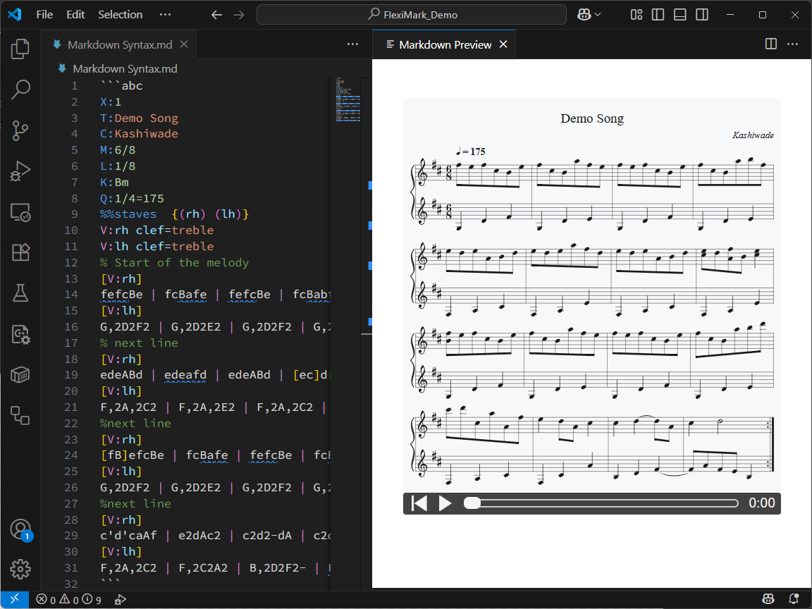
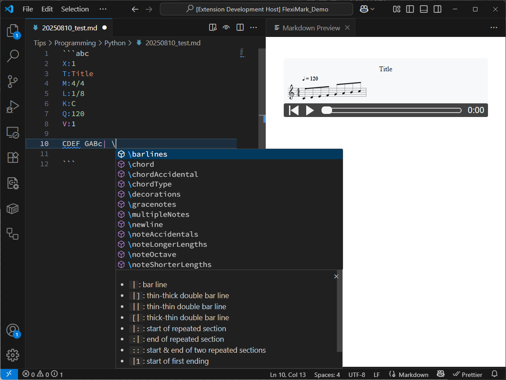

# Extended Markdown Syntax

Introducing the extended Markdown syntax supported by FlexiMark.

## Overview

In addition to the features covered in the [Basic Markdown Syntax](./basic-markdown-syntax.md), FlexiMark supports its own extended syntax. While these additions are not widely recognized as standard, we’ve included them because they’re useful for taking everyday notes in Markdown.

## Admonition/Alert Syntax

This feature is equivalent to [Docusaurus Admonitions](https://docusaurus.io/docs/markdown-features/admonitions) and [GitHub Alerts](https://docs.github.com/get-started/writing-on-github/getting-started-with-writing-and-formatting-on-github/basic-writing-and-formatting-syntax#alerts). You can use various Markdown elements within these blocks. Additionally, using [“Collect Admonitions”](../feature/collect-admonitions.md), you can gather and organize all Admonitions/Alerts from notes under a specified category into a single Markdown file.

```plaintext
:::info

Lorem ipsum dolor sit amet, consectetur adipiscing elit.

:::

:::tip

Lorem ipsum dolor sit amet, consectetur adipiscing elit.

:::

:::warning

Lorem ipsum dolor sit amet, consectetur adipiscing elit.

:::

:::danger

Lorem ipsum dolor sit amet, consectetur adipiscing elit.

:::
```


You can also add custom titles to Admonitions/Alerts. These titles can include Markdown syntax.

```plaintext
:::info[*Custom* ~Title~]

Lorem ipsum dolor sit amet, consectetur adipiscing elit.

:::

:::tip[*Custom* ~Title~]

Lorem ipsum dolor sit amet, consectetur adipiscing elit.

:::

:::warning[*Custom* ~Title~]

Lorem ipsum dolor sit amet, consectetur adipiscing elit.

:::

:::danger[*Custom* ~Title~]

Lorem ipsum dolor sit amet, consectetur adipiscing elit.

:::
```


:::tip

Admonitions/Alerts can be nested. It's recommended to use a different number of colons (`:`) to define matching pairs.


:::

## Tabs Syntax

You can create tabs to separate content. All standard Markdown syntax can be used within the tabs.

```plaintext
::::tabs

:::tab[Tab 1]

Lorem ipsum dolor sit amet, consectetur adipiscing elit.

:::

:::tab[Tab 2]

Lorem ipsum dolor sit amet, consectetur adipiscing elit.

:::

::::
```


## Collapsible Sections

This syntax works as an alternative to the HTML `<details>` tag. You can also add custom titles.

```plaintext
:::details

**Collapsible Section (Click to Expand)**

Lorem ipsum dolor sit amet, consectetur adipiscing elit.

:::

:::details[Custom Title]

**Collapsible Section (After Manual Expansion)**

Lorem ipsum dolor sit amet, consectetur adipiscing elit.

:::
```



## YouTube iframe

When a YouTube URL is added as a standalone paragraph, it is automatically converted into an iframe. This works with both full and shortened URLs. However, URLs embedded within a paragraph will not be converted.

```plaintext
https://youtu.be/G1W3aroArqY

Lorem https://youtu.be/G1W3aroArqY dolor sit amet, consectetur adipiscing elit.
```


:::warning

YouTube iframes do not work correctly in the VSCode preview. Use a browser preview to view them properly.

:::

## Code Blocks

In addition to syntax highlighting, FlexiMark supports code block titles, line numbers, and line highlighting.

````plaintext
```js
document.body.addEventListener('click', () => {
  const colors = ['blue', 'green', 'pink', 'yellow'];
  const randomColor = colors[Math.floor(Math.random() * colors.length)];
  document.body.style.backgroundColor = randomColor;
});
```

```js title="color.js"
document.body.addEventListener('click', () => {
  const colors = ['blue', 'green', 'pink', 'yellow'];
  const randomColor = colors[Math.floor(Math.random() * colors.length)];
  document.body.style.backgroundColor = randomColor;
});
```

```js title="color.js" showLineNumbers
document.body.addEventListener('click', () => {
  const colors = ['blue', 'green', 'pink', 'yellow'];
  const randomColor = colors[Math.floor(Math.random() * colors.length)];
  document.body.style.backgroundColor = randomColor;
});
```

```js title="color.js" showLineNumbers {1,3-5}
document.body.addEventListener('click', () => {
  const colors = ['blue', 'green', 'pink', 'yellow'];
  const randomColor = colors[Math.floor(Math.random() * colors.length)];
  document.body.style.backgroundColor = randomColor;
});
```
````


## Mermaid

You can use [Mermaid](https://mermaid.js.org) to render diagrams of various types.

````plaintext

````


:::tip

For Mermaid syntax highlighting, it’s recommended to install the following extension:

- [Mermaid Markdown Syntax Highlighting](https://marketplace.visualstudio.com/items?itemName=bpruitt-goddard.mermaid-markdown-syntax-highlighting)

:::

## ABC Notation

FlexiMark supports [ABC notation](https://abcnotation.com), allowing you to write sheet music. Features include syntax highlighting, snippets, music playback, and visual cues for cursor position.

````plaintext
```abc
X:1
T:Demo Song
C:Kashiwade
M:6/8
L:1/8
K:Bm
Q:1/4=175
%%staves  {(rh) (lh)}
V:rh clef=treble 
V:lh clef=treble
% Start of the melody
[V:rh]
fefcBe | fcBafe | fefcBe | fcBabf |
[V:lh]
G,2D2F2 | G,2D2E2 | G,2D2F2 | G,2D2E2 |
% next line
[V:rh]
edeABd | edeafd | edeABd | [ec]d[fA]B[ec]2 |
[V:lh]
F,2A,2C2 | F,2A,2E2 | F,2A,2C2 | F,2A,2E2 |
%next line
[V:rh]
[fB]efcBe | fcBafe | fefcBe | fcBabd' |
[V:lh]
G,2D2F2 | G,2D2E2 | G,2D2F2 | G,2D2E2 |
%next line
[V:rh]
c'd'caAf | e2dAc2 | c2d2-dA | c2d4 :|
[V:lh]
F,2A,2C2 | F,2C2A2 | B,2D2F2- | FAFEB,2 :|
```
````



Typing a backslash (`\`) inside an ABC code block will bring up snippet suggestions for ABC notation.



Typing an exclamation mark (`!`) inside an ABC block will bring up symbol snippet suggestions.

