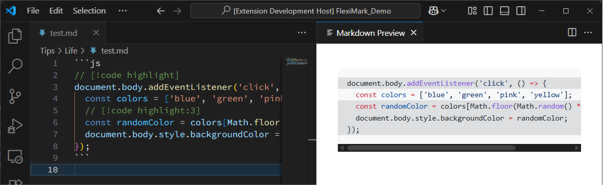
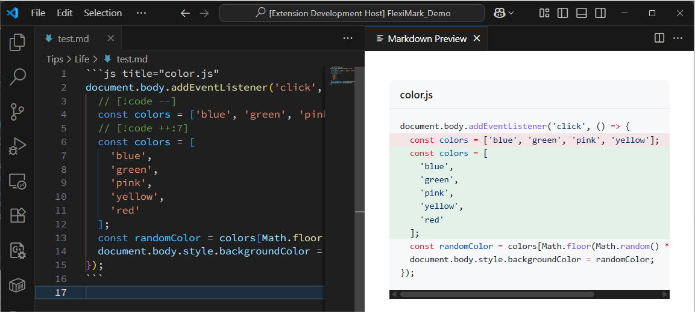
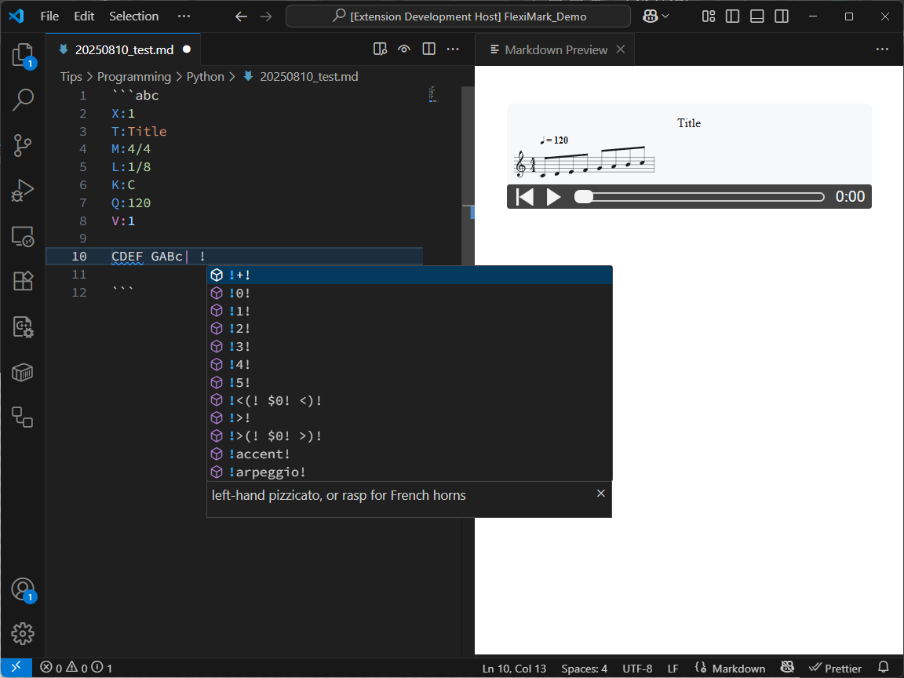

import Tabs from '@theme/Tabs';
import TabItem from '@theme/TabItem';

# Extended Markdown Syntax

Here are the extended Markdown syntaxes supported by FlexiMark.

## Overview

In addition to the [basic Markdown syntax](./basic-markdown-syntax.md), FlexiMark supports its own extended syntax.  
While these notations are not widely standardized, they are supported because we believe they are useful for taking daily notes in Markdown.

## LaTeX

You can write mathematical expressions using [KaTeX](https://katex.org).

```plaintext
Lorem ipsum $e^x = \sum_{n=0}^{\infty} \frac{x^n}{n!}$ sit amet, consectetur adipiscing elit.

$$
e^x = \sum_{n=0}^{\infty} \frac{x^n}{n!}
$$
```


## Admonition/Alert Syntax

This provides functionality equivalent to [Docusaurus Admonitions](https://docusaurus.io/docs/markdown-features/admonitions) or [GitHub Alerts](https://docs.github.com/get-started/writing-on-github/getting-started-with-writing-and-formatting-on-github/basic-writing-and-formatting-syntax#alerts).  
You can use any Markdown syntax inside the block.  
Additionally, by using [Collecting Admonitions/Alerts](../feature/collect-admonitions.md), you can gather all admonitions/alerts across notes under a specified category into a single Markdown file for organization.

```plaintext
:::info

Lorem ipsum dolor sit amet, consectetur adipiscing elit.

:::

:::tip

Lorem ipsum dolor sit amet, consectetur adipiscing elit.

:::

:::warning

Lorem ipsum dolor sit amet, consectetur adipiscing elit.

:::

:::danger

Lorem ipsum dolor sit amet, consectetur adipiscing elit.

:::
```


You can also add custom titles to admonitions/alerts, with support for Markdown formatting in the title.

```plaintext
:::info[*Custom* ~Title~]

Lorem ipsum dolor sit amet, consectetur adipiscing elit.

:::

:::tip[*Custom* ~Title~]

Lorem ipsum dolor sit amet, consectetur adipiscing elit.

:::

:::warning[*Custom* ~Title~]

Lorem ipsum dolor sit amet, consectetur adipiscing elit.

:::

:::danger[*Custom* ~Title~]

Lorem ipsum dolor sit amet, consectetur adipiscing elit.

:::
```


:::tip

Admonitions/alerts can also be nested. It’s recommended to vary the number of colons (`:`) to create proper pairs.


:::

## Tabs Syntax

You can create tabs to separate content. Any Markdown syntax can be used inside.

```plaintext
::::tabs

:::tab[Tab 1]

Lorem ipsum dolor sit amet, consectetur adipiscing elit.

:::

:::tab[Tab 2]

Lorem ipsum dolor sit amet, consectetur adipiscing elit.

:::

::::
```


## Collapsible Section

An alternative to the HTML `<details>` tag. You can also add a custom title.

```plaintext
:::details

**Collapsible Section (Click to Expand)**

Lorem ipsum dolor sit amet, consectetur adipiscing elit.

:::

:::details[Custom Title]

**Collapsible Section (After Manual Expansion)**

Lorem ipsum dolor sit amet, consectetur adipiscing elit.

:::
```


## YouTube iframe

When a YouTube URL is added as a single paragraph, it is automatically converted into an iframe.  
Non-shortened URLs are also supported. If the URL appears within a paragraph, it won’t be converted into an iframe.

```plaintext
https://youtu.be/G1W3aroArqY

Lorem https://youtu.be/G1W3aroArqY dolor sit amet, consectetur adipiscing elit.
```


:::warning

In VSCode preview, iframes don’t work correctly. Use browser preview if you want to run iframes.

:::

## Code Blocks

In addition to syntax highlighting, code blocks support titles, line numbers, line highlighting, word highlighting, and diff highlighting.

### Basic Syntax

For simple syntax highlighting, write as follows. After the backticks, specify the language (`plaintext`, `js`, `py`, etc.).

````plaintext
```js
document.body.addEventListener('click', () => {
  const colors = ['blue', 'green', 'pink', 'yellow'];
  const randomColor = colors[Math.floor(Math.random() * colors.length)];
  document.body.style.backgroundColor = randomColor;
});
```
````


### Title

To add a title, write as follows. The language name is required.

````plaintext
```js title="color.js"
document.body.addEventListener('click', () => {
  const colors = ['blue', 'green', 'pink', 'yellow'];
  const randomColor = colors[Math.floor(Math.random() * colors.length)];
  document.body.style.backgroundColor = randomColor;
});
```
````


### Line Numbers

To show line numbers, write as follows. The language name is required.

<Tabs>
  <TabItem value="Simple Example" label="Simple Example" default>
    ````plaintext
    ```js showLineNumbers
    document.body.addEventListener('click', () => {
      const colors = ['blue', 'green', 'pink', 'yellow'];
      const randomColor = colors[Math.floor(Math.random() * colors.length)];
      document.body.style.backgroundColor = randomColor;
    });
    ```
    ````
    
  </TabItem>
  <TabItem value="Starting from a specific number" label="Starting from a specific number">
    ````plaintext
    ```js showLineNumbers=5
    document.body.addEventListener('click', () => {
      const colors = ['blue', 'green', 'pink', 'yellow'];
      const randomColor = colors[Math.floor(Math.random() * colors.length)];
      document.body.style.backgroundColor = randomColor;
    });
    ```
    ````
    
  </TabItem>
</Tabs>

### Line Highlighting

To highlight specific lines, write as follows. The language name is required.

<Tabs>
  <TabItem value="Simple Example" label="Simple Example" default>
    Line 1 and lines 3–5 are highlighted.
    ````plaintext
    ```js {1,3-5}
    document.body.addEventListener('click', () => {
      const colors = ['blue', 'green', 'pink', 'yellow'];
      const randomColor = colors[Math.floor(Math.random() * colors.length)];
      document.body.style.backgroundColor = randomColor;
    });
    ```
    ````
    
  </TabItem>
  <TabItem value="Inline notation" label="Inline notation">
    You can also add `[!code highlight]` as a comment. This produces the same highlighting (line 1 and lines 3–5).
    ````plaintext
    ```js
    // [!code highlight]
    document.body.addEventListener('click', () => {
      const colors = ['blue', 'green', 'pink', 'yellow'];
      // [!code highlight:3]
      const randomColor = colors[Math.floor(Math.random() * colors.length)];
      document.body.style.backgroundColor = randomColor;
    });
    ```
    ````
    
  </TabItem>
</Tabs>

### Diff Highlighting

To show diff-style highlights, add `[!code --]` or `[!code ++]` as comments. The language name is required.

<Tabs>
  <TabItem value="Simple Example" label="Simple Example" default>
    ````plaintext
    ```js title="color.js"
    document.body.addEventListener('click', () => {
      // [!code --]
      const colors = ['blue', 'green', 'pink', 'yellow'];
      // [!code ++:7]
      const colors = [
        'blue', 
        'green', 
        'pink', 
        'yellow', 
        'red'
      ];
      const randomColor = colors[Math.floor(Math.random() * colors.length)];
      document.body.style.backgroundColor = randomColor;
    });
    ```
    ````
    
  </TabItem>
  <TabItem value="Combined with line numbers" label="Combined with line numbers">
    ````plaintext
    ```js title="color.js" showLineNumbers
    document.body.addEventListener('click', () => {
      // [!code --]
      const colors = ['blue', 'green', 'pink', 'yellow'];
      // [!code ++:7]
      const colors = [
        'blue', 
        'green', 
        'pink', 
        'yellow', 
        'red'
      ];
      const randomColor = colors[Math.floor(Math.random() * colors.length)];
      document.body.style.backgroundColor = randomColor;
    });
    ```
    ````
    
  </TabItem>
</Tabs>

### Word Highlighting

You can highlight specific words inside a code block.

````plaintext
```js title="color.js" /colors/
document.body.addEventListener('click', () => {
  const colors = ['blue', 'green', 'pink', 'yellow'];
  const randomColor = colors[Math.floor(Math.random() * colors.length)];
  document.body.style.backgroundColor = randomColor;
});
```
````


## Mermaid

You can render diagrams using [Mermaid](https://mermaid.js.org).

````plaintext

````


:::tip

For better Mermaid syntax highlighting, we recommend installing this extension:

- [Mermaid Markdown Syntax Highlighting](https://marketplace.visualstudio.com/items?itemName=bpruitt-goddard.mermaid-markdown-syntax-highlighting)

:::

## ABC Notation

Supports [ABC Notation](https://abcnotation.com) for writing musical scores.  
Also supports syntax highlighting, snippets, playback, and cursor position indication.

````plaintext
```abc
X:1
T:Demo Song
C:Kashiwade
M:6/8
L:1/8
K:Bm
Q:1/4=175
%%staves  {(rh) (lh)}
V:rh clef=treble 
V:lh clef=treble
% Start of the melody
[V:rh]
fefcBe | fcBafe | fefcBe | fcBabf |
[V:lh]
G,2D2F2 | G,2D2E2 | G,2D2F2 | G,2D2E2 |
% next line
[V:rh]
edeABd | edeafd | edeABd | [ec]d[fA]B[ec]2 |
[V:lh]
F,2A,2C2 | F,2A,2E2 | F,2A,2C2 | F,2A,2E2 |
%next line
[V:rh]
[fB]efcBe | fcBafe | fefcBe | fcBabd' |
[V:lh]
G,2D2F2 | G,2D2E2 | G,2D2F2 | G,2D2E2 |
%next line
[V:rh]
c'd'caAf | e2dAc2 | c2d2-dA | c2d4 :|
[V:lh]
F,2A,2C2 | F,2C2A2 | B,2D2F2- | FAFEB,2 :|
```
````


Inside an ABC code block, typing a backslash (`\`) will trigger ABC notation snippets.


Typing an exclamation mark (`!`) inside an ABC code block will trigger symbol snippets.
