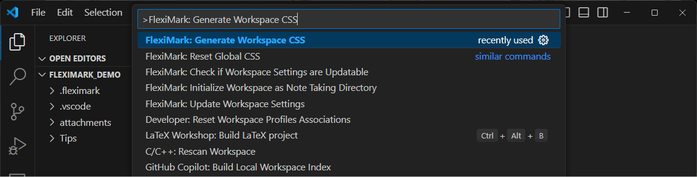
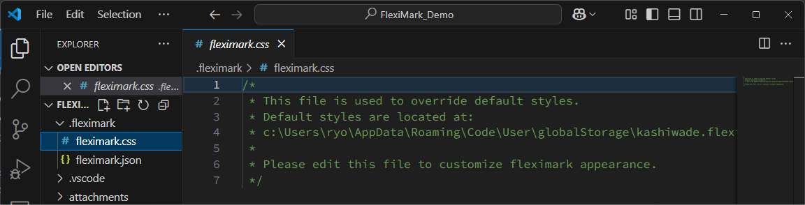
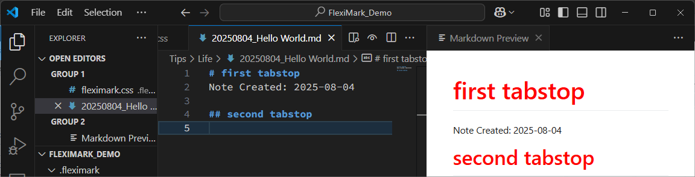

# CSS

プレビュー時のスタイルを変更できます。

## 概要

FlexiMarkのプレビュー時のスタイルは下記の3つのCSSによって決まります。

1. グローバルCSS
2. ワークスペースCSS
3. Markdownファイル中の`<style>`タグ

ワークスペースCSSに書かれた項目はグローバルCSSを上書きします。従って、一部の項目だけスタイルを変更することが可能です。

## 変更方法

`F1`キーを押下し、下記を入力してください。入力したら`Enter`キーを押してください。
```plaintext
FlexiMark: Generate Workspace CSS
```


すると`.fleximark/fleximark.css`が生成されます。


例えば下記のように編集し、見出しの文字色が赤色になるように設定してみます。

```css title=".fleximark/fleximark.css" {9-16}
/* 
 * This file is used to override default styles.
 * Default styles are located at:
 * c:\Users\ryo\AppData\Roaming\Code\User\globalStorage\kashiwade.fleximark\fleximark.css
 * 
 * Please edit this file to customize fleximark appearance.
 */

.markdown-body h1,
.markdown-body h2,
.markdown-body h3,
.markdown-body h4,
.markdown-body h5,
.markdown-body h6 {
  color: red;
}
```

ワークスペース内の任意のMarkdownファイルを開きましょう。見出しの色が赤色になっていることが確認できます。



:::tip

FlexiMarkプレビュー時のHTMLは、全て`<div class="markdown-body>`の子要素として出力されます。そのため、スタイル設定時はスコープを`.markdown-body`に絞るのがおすすめです。

:::

:::warning

現在開いているプレビュー画面にCSSの変更を反映させるには、プレビュー画面を更新する必要があります。
プレビュー画面を閉じて再度開き直すか、下記の操作を行ってください。

- ブラウザ: 更新(リロード)ボタンを押す
- VSCode: エディタ上で別のテキストエディタタブを選択した後、元のファイルを選択する。

:::