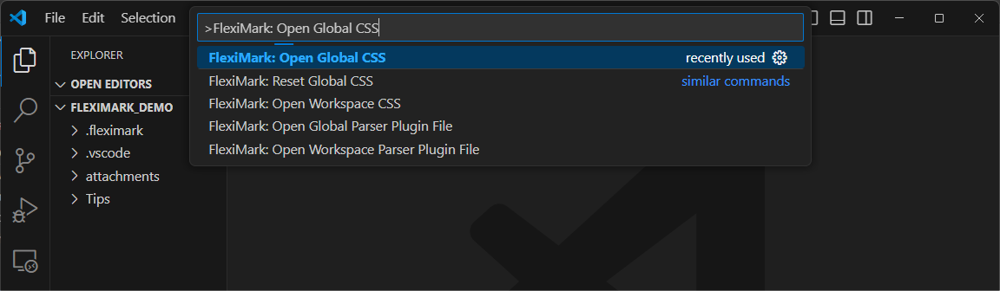
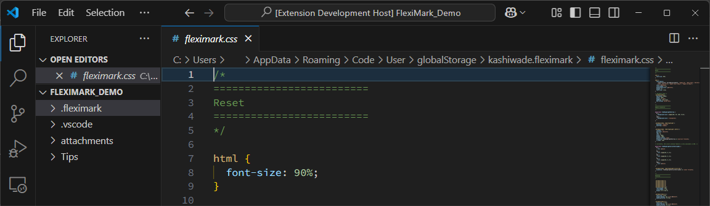
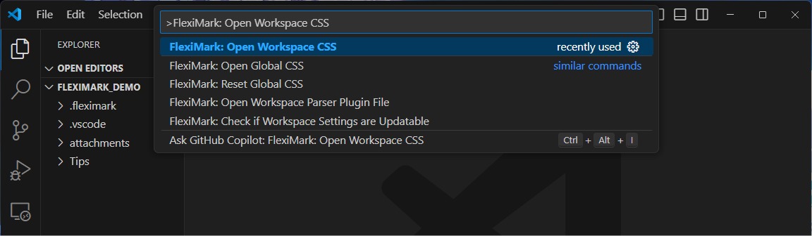
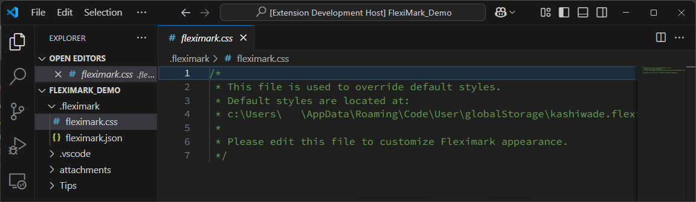
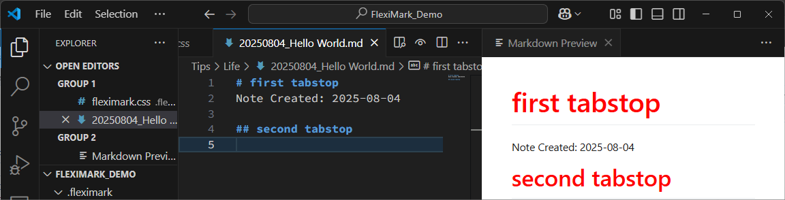

# CSS

FlexiMarkでは、プレビュー画面のスタイルを自由にカスタマイズできます。

## 概要

プレビュー時の見た目は、以下の3種類のCSSによって決まります。

1. Global CSS
2. Workspace CSS
3. Markdownファイル内の`<style>`タグ

Workspace CSSは、Global CSSを上書きします。これにより、一部のスタイルだけを変更することも可能です。

## 変更方法

### Global CSS

`F1`キーを押下し、下記を入力してください。入力したら`Enter`キーを押してください。

```plaintext
FlexiMark: Open Workspace CSS
```



この操作により、Global CSSがプレビューされます。このファイルを編集することで、スタイルを変更できます。



### Workspace CSS

`F1`キーを押下し、下記を入力してください。入力したら`Enter`キーを押してください。

```plaintext
FlexiMark: Open Global CSS
```



この操作により、ワークスペース内に `.fleximark/fleximark.css` というファイルが作成されます。


このファイルを編集することで、スタイルを変更できます。たとえば、見出しの文字色を赤にしたい場合は、以下のように記述します。

```css title=".fleximark/fleximark.css" {9-16}
/* 
 * This file is used to override default styles.
 * Default styles are located at:
 * c:\Users\   \AppData\Roaming\Code\User\globalStorage\kashiwade.fleximark\fleximark.css
 * 
 * Please edit this file to customize fleximark appearance.
 */

.markdown-body h1,
.markdown-body h2,
.markdown-body h3,
.markdown-body h4,
.markdown-body h5,
.markdown-body h6 {
  color: red;
}
```

この設定を保存した後、任意のMarkdownファイルを開くと、見出しが赤く表示されるようになります。



:::tip

FlexiMarkのプレビューでは、すべてのHTML要素が `<div class="markdown-body">` の中に含まれます。そのため、CSSを書く際は `.markdown-body` をスコープとして指定するのがおすすめです。

:::

:::warning

CSSの変更をプレビューに反映させるには、プレビュー画面を更新する必要があります。\
`F1`キーを押下し、下記を入力してください。入力したら`Enter`キーを押してください。

```plaintext
FlexiMark: Force Reload Preview
```

:::