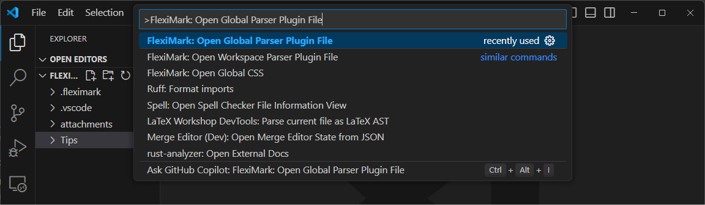
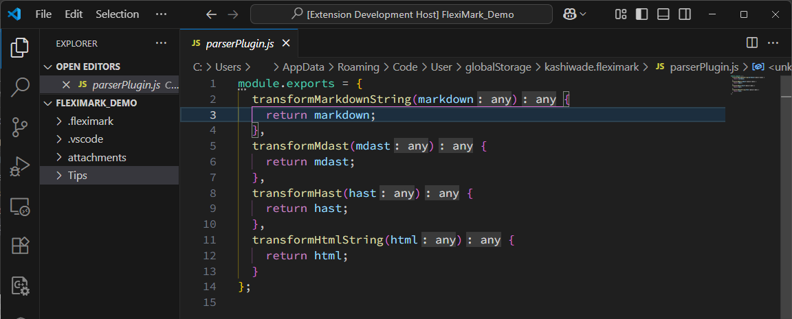
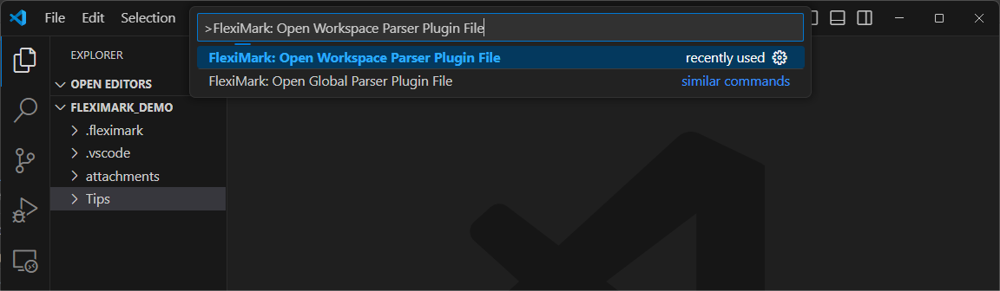
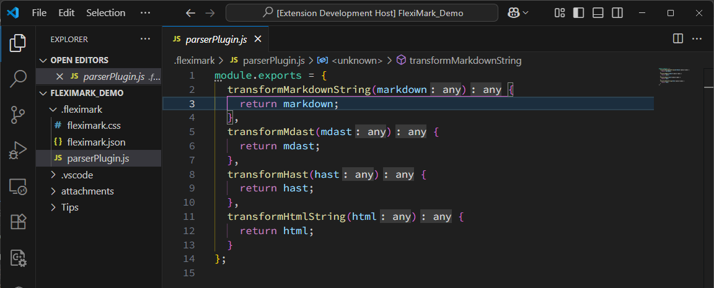
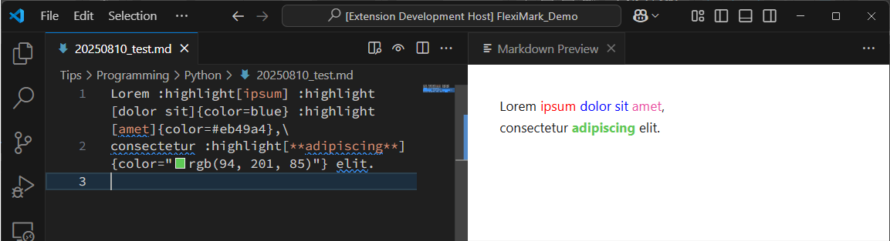

# 文法の拡張

FlexiMarkでは、Markdownの文法を自由に拡張することができます。

## 概要

FlexiMarkでは下記のフローに従ってMarkdownをHTMLに変換し、プレビュー表示を行っています。ユーザーは下記の`Plugin`の部分に存在する各処理を記述することで、Markdownの文法を拡張できます。


:::info[Mdast・Hastとは？]

MarkdownをHTMLに変換する過程では、単純に文字列置換を行うのではなく、一度「構造化されたデータ」に変換してから処理を進めます。このとき使われる中間表現が **MDAST** と **HAST** です。

### [MDAST（Markdown Abstract Syntax Tree）](https://github.com/syntax-tree/mdast)

MDAST は「Markdown Abstract Syntax Tree」の略で、Markdown 文書の構造を表現する抽象構文木（AST）です。
例えば、次のような Markdown:

```markdown
# Heading
Main **Strong**
```

は、MDAST では以下のような構造で表現されます:

```json
{
  "type": "root",
  "children": [
    {
      "type": "heading", "depth": 1,
      "children": [
        {
          "type": "text", "value": "Heading",
          "position": {
            "start": { "line": 1, "column": 3, "offset": 2 },
            "end": { "line": 1, "column": 10, "offset": 9 }
          }
        }
      ],
      "position": {
        "start": { "line": 1, "column": 1, "offset": 0 },
        "end": { "line": 1, "column": 10, "offset": 9 }
      }
    },
    {
      "type": "paragraph",
      "children": [
        {
          "type": "text", "value": "Main ",
          "position": {
            "start": { "line": 2, "column": 1, "offset": 10 },
            "end": { "line": 2, "column": 6, "offset": 15 }
          }
        },
        {
          "type": "strong",
          "children": [
            {
              "type": "text", "value": "Strong",
              "position": {
                "start": { "line": 2, "column": 8, "offset": 17 },
                "end": { "line": 2, "column": 14, "offset": 23 }
              }
            }
          ],
          "position": {
            "start": { "line": 2, "column": 6, "offset": 15 },
            "end": { "line": 2, "column": 16, "offset": 25 }
          }
        }
      ],
      "position": {
        "start": { "line": 2, "column": 1, "offset": 10 },
        "end": { "line": 2, "column": 16, "offset": 25 }
      }
    }
  ],
  "position": {
    "start": { "line": 1, "column": 1, "offset": 0 },
    "end": { "line": 2, "column": 16, "offset": 25 }
  }
}
```

この構造を操作すれば、Markdown の特定の要素を追加・削除・変換できます。

### [HAST（Hypertext Abstract Syntax Tree）](https://github.com/syntax-tree/hast)

HAST は「Hypertext Abstract Syntax Tree」の略で、HTML 文書を構造化した抽象構文木です。
MDAST を HTML に変換するとき、まず MDAST から HAST に変換し、その後 HTML 文字列にシリアライズします。

先ほどの例を HAST に変換すると、次のような構造になります:

```json
{
  "type": "root",
  "children": [
    {
      "type": "element",
      "tagName": "h1",
      "properties": { "data-line-number": "1" },
      "children": [
        { "type": "text", "value": "Heading" }
      ]
    },
    { "type": "text", "value": "\n" },
    {
      "type": "element", "tagName": "p",
      "properties": { "data-line-number": "2" },
      "children": [
        { "type": "text", "value": "Main " },
        {
          "type": "element", "tagName": "strong",
          "properties": {},
          "children": [
            { "type": "text", "value": "Strong" }
          ]
        }
      ]
    }
  ],
  "data": { "quirksMode": false }
}
```

:::

## 変更方法

### Global Parser

`F1`キーを押下し、下記を入力してください。入力したら`Enter`キーを押してください。

```plaintext
FlexiMark: Open Global Parser Plugin File
```




この操作により、Global Parser Pluginがプレビューされます。このファイルを編集することで、Markdown文法を拡張できます。



### Workspace Parser

`F1`キーを押下し、下記を入力してください。入力したら`Enter`キーを押してください。

```plaintext
FlexiMark: Open Workspace Parser Plugin File
```



この操作により、Workspace Parser Pluginがプレビューされます。このファイルを編集することで、Markdown文法を拡張できます。


## チュートリアル

実際に独自文法を設定してみましょう。独自文法を設定する際は[Directive記法](https://github.com/micromark/micromark-extension-directive?tab=readme-ov-file#syntax)を用いるのが簡便です。

::::info[Directive記法とは？]

Directive記法は、Markdown内に「特殊な命令ブロック」を埋め込み、レンダリング時に独自の処理やカスタム要素を挿入できるようにするための拡張記法です。
もともとは[CommonMarkの拡張案](https://talk.commonmark.org/t/generic-directives-plugins-syntax/444)のひとつで、プラグインを通してHTMLやその他の出力形式に変換されます。

### TextDirective

インラインで挿入可能なDirectiveです。

```markdown title="Markdown"
:name[content]{key=val}
```

```json title="MDAST"
{
  "type": "root",
  "children": [
    {
      "type": "paragraph",
      "children": [
        {
          "type": "textDirective", "name": "name",
          "attributes": { "key": "val" },
          "children": [
            {
              "type": "text", "value": "content",
              "position": {
                "start": { "line": 1, "column": 7, "offset": 6 },
                "end": { "line": 1, "column": 14, "offset": 13 }
              }
            }
          ],
          "position": {
            "start": { "line": 1, "column": 1, "offset": 0 },
            "end": { "line": 1, "column": 24, "offset": 23 }
          }
        }
      ],
      "position": {
        "start": { "line": 1, "column": 1, "offset": 0 },
        "end": { "line": 1, "column": 24, "offset": 23 }
      }
    }
  ],
  "position": {
    "start": { "line": 1, "column": 1, "offset": 0 },
    "end": { "line": 2, "column": 1, "offset": 24 }
  }
}
```

### LeafDirective

TextDirectiveと近い記法ですが、インラインで使うことはできません。

```markdown title="Markdown"
::name[content]{key=val}
```

```json title="MDAST"
{
  "type": "root",
  "children": [
    {
      "type": "leafDirective", "name": "name",
      "attributes": { "key": "val" },
      "children": [
        {
          "type": "text", "value": "content",
          "position": {
            "start": { "line": 1, "column": 8, "offset": 7 },
            "end": { "line": 1, "column": 15, "offset": 14 }
          }
        }
      ],
      "position": {
        "start": { "line": 1, "column": 1, "offset": 0 },
        "end": { "line": 1, "column": 25, "offset": 24 }
      }
    }
  ],
  "position": {
    "start": { "line": 1, "column": 1, "offset": 0 },
    "end": { "line": 1, "column": 25, "offset": 24 }
  }
}
```

### ContainerDirective

ブロックを構成できるDirectiveです。[Markdownの文法（拡張）](../basics/extended-markdown-syntax.md)で紹介した一部の記法はContainerDirectiveを利用しています。

```markdown title="Markdown"
:::name[content]{key=val}

block content

:::
```

```json title="MDAST"
{
  "type": "root",
  "children": [
    {
      "type": "containerDirective", "name": "name",
      "attributes": { "key": "val" },
      "children": [
        {
          "type": "paragraph",
          "data": { "directiveLabel": true },
          "children": [
            {
              "type": "text", "value": "content",
              "position": {
                "start": { "line": 1, "column": 9, "offset": 8 },
                "end": { "line": 1, "column": 16, "offset": 15 }
              }
            }
          ],
          "position": {
            "start": { "line": 1, "column": 8, "offset": 7 },
            "end": { "line": 1, "column": 17, "offset": 16 }
          }
        },
        {
          "type": "paragraph",
          "children": [
            {
              "type": "text", "value": "block content",
              "position": {
                "start": { "line": 3, "column": 1, "offset": 27 },
                "end": { "line": 3, "column": 14, "offset": 40 }
              }
            }
          ],
          "position": {
            "start": { "line": 3, "column": 1, "offset": 27 },
            "end": { "line": 3, "column": 14, "offset": 40 }
          }
        }
      ],
      "position": {
        "start": { "line": 1, "column": 1, "offset": 0 },
        "end": { "line": 5, "column": 4, "offset": 45 }
      }
    }
  ],
  "position": {
    "start": { "line": 1, "column": 1, "offset": 0 },
    "end": { "line": 5, "column": 4, "offset": 45 }
  }
}
```

::::

TextDirectiveを使ったサンプルを作ってみましょう。このDirectiveは`:highlight[content]{color=red}`とすることで、文字の色を自由に設定できます。\
下記のように`parserPlugin.js`を編集してください。HTML要素の設定は`data.hName`や`data.Properties`で設定できます。

```javascript title="parserPlugin.js" {6-16,26-47}
module.exports = {
  transformMarkdownString(markdown) {
    return markdown;
  },
  transformMdast(mdast) {
    visit(mdast, "textDirective", (node) => {
      if (node.name === "highlight") {
        const color = node.attributes?.color || "red";
        node.data = {
          hName: "span",
          hProperties: { style: `color: ${color}` },
        };
      }
    });

    return mdast;
  },
  transformHast(hast) {
    return hast;
  },
  transformHtmlString(html) {
    return html;
  },
};

function visit(tree, types, visitor) {
  const typeSet = types == null
    ? null
    : new Set(Array.isArray(types) ? types : [types]);

  function walk(node, index, parent) {
    if (!node || typeof node !== "object") return;

    const shouldVisit = typeSet === null || typeSet.has(node.type);
    if (shouldVisit) {
      if (visitor(node, index, parent) === false) return;
    }

    if (Array.isArray(node.children)) {
      for (let i = 0; i < node.children.length; i++) {
        walk(node.children[i], i, node);
      }
    }
  }

  walk(tree, null, null);
}
```

適当なMarkdownファイルを作成して、次のように入力しましょう。添付図のような見た目になれば成功です。


```plaintext collapse
Lorem :highlight[ipsum] :highlight[dolor sit]{color=blue} :highlight[amet]{color=#eb49a4},\
consectetur :highlight[**adipiscing**]{color="rgb(94, 201, 85)"} elit. 
```

