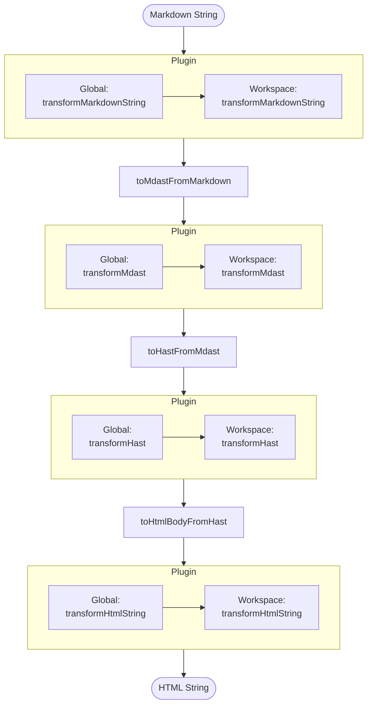
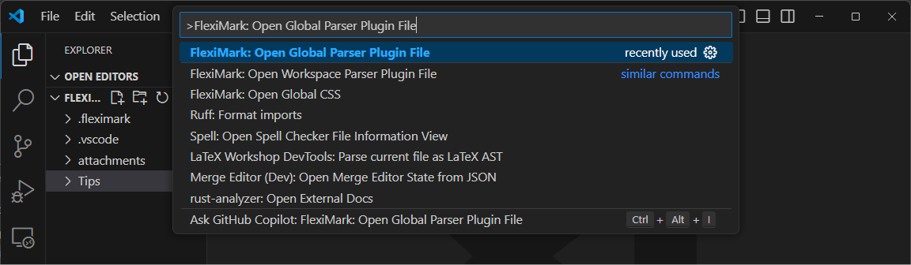
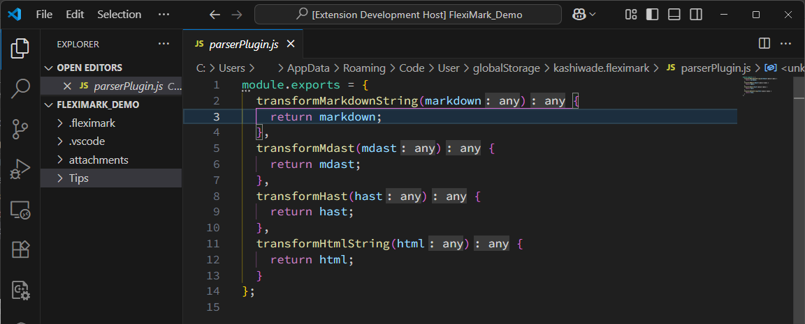
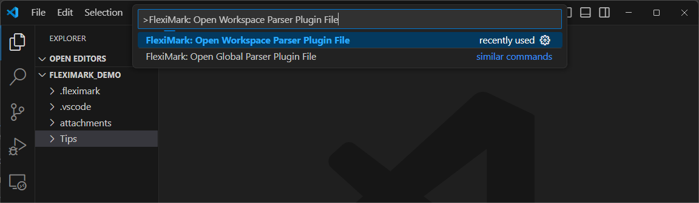
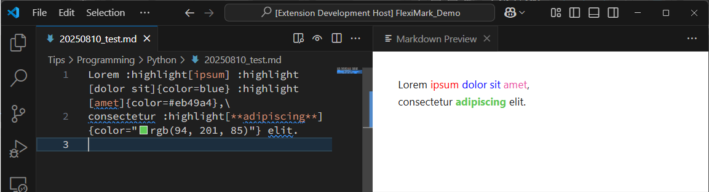

# Extending Markdown Syntax

FlexiMark allows you to freely extend Markdown syntax.

## Overview

FlexiMark converts Markdown to HTML and displays a preview according to the flow shown below. You can extend Markdown syntax by adding your own processing in the `Plugin` sections.



:::info[What are Mdast and Hast?]

During the Markdown-to-HTML conversion process, rather than simply performing string replacements, the content is first converted into structured data and processed. The intermediate representations used are **MDAST** and **HAST**.

### [MDAST (Markdown Abstract Syntax Tree)](https://github.com/syntax-tree/mdast)

MDAST stands for "Markdown Abstract Syntax Tree", an abstract syntax tree that represents the structure of a Markdown document.  
For example, the following Markdown:

```markdown
# Heading
Main **Strong**
```

Would be represented in MDAST as:

```json
{
  "type": "root",
  "children": [
    {
      "type": "heading", "depth": 1,
      "children": [
        {
          "type": "text", "value": "Heading",
          "position": {
            "start": { "line": 1, "column": 3, "offset": 2 },
            "end": { "line": 1, "column": 10, "offset": 9 }
          }
        }
      ],
      "position": {
        "start": { "line": 1, "column": 1, "offset": 0 },
        "end": { "line": 1, "column": 10, "offset": 9 }
      }
    },
    {
      "type": "paragraph",
      "children": [
        {
          "type": "text", "value": "Main ",
          "position": {
            "start": { "line": 2, "column": 1, "offset": 10 },
            "end": { "line": 2, "column": 6, "offset": 15 }
          }
        },
        {
          "type": "strong",
          "children": [
            {
              "type": "text", "value": "Strong",
              "position": {
                "start": { "line": 2, "column": 8, "offset": 17 },
                "end": { "line": 2, "column": 14, "offset": 23 }
              }
            }
          ],
          "position": {
            "start": { "line": 2, "column": 6, "offset": 15 },
            "end": { "line": 2, "column": 16, "offset": 25 }
          }
        }
      ],
      "position": {
        "start": { "line": 2, "column": 1, "offset": 10 },
        "end": { "line": 2, "column": 16, "offset": 25 }
      }
    }
  ],
  "position": {
    "start": { "line": 1, "column": 1, "offset": 0 },
    "end": { "line": 2, "column": 16, "offset": 25 }
  }
}
```

By manipulating this structure, you can add, remove, or transform specific elements in the Markdown.

### [HAST (Hypertext Abstract Syntax Tree)](https://github.com/syntax-tree/hast)

HAST stands for "Hypertext Abstract Syntax Tree", a structured representation of an HTML document.  
When converting Markdown to HTML, the process first transforms MDAST to HAST, and then serializes it into an HTML string.

The above example, when converted to HAST, would look like:

```json
{
  "type": "root",
  "children": [
    {
      "type": "element",
      "tagName": "h1",
      "properties": { "data-line-number": "1" },
      "children": [
        { "type": "text", "value": "Heading" }
      ]
    },
    { "type": "text", "value": "\n" },
    {
      "type": "element", "tagName": "p",
      "properties": { "data-line-number": "2" },
      "children": [
        { "type": "text", "value": "Main " },
        {
          "type": "element", "tagName": "strong",
          "properties": {},
          "children": [
            { "type": "text", "value": "Strong" }
          ]
        }
      ]
    }
  ],
  "data": { "quirksMode": false }
}
```

:::

## How to Modify

### Global Parser

Press the `F1` key and enter the following command, then press `Enter`.

```plaintext
FlexiMark: Open Global Parser Plugin File
```



This will open a preview of the Global Parser Plugin file. You can extend Markdown syntax by editing this file.  


### Workspace Parser

Press the `F1` key and enter the following command, then press `Enter`.

```plaintext
FlexiMark: Open Workspace Parser Plugin File
```



This will open a preview of the Workspace Parser Plugin file. You can extend Markdown syntax by editing this file.  


## Tutorial

Let’s try defining a custom syntax. The easiest way to define a custom syntax is by using the [Directive syntax](https://github.com/micromark/micromark-extension-directive?tab=readme-ov-file#syntax).

::::info[What is Directive Syntax?]

Directive syntax is an extension for embedding “special instruction blocks” in Markdown, allowing you to insert custom behavior or elements during rendering.  
Originally proposed as a [CommonMark extension](https://talk.commonmark.org/t/generic-directives-plugins-syntax/444), it uses plugins to convert to HTML or other output formats.

### TextDirective

A directive that can be inserted inline.

```markdown title="Markdown"
:name[content]{key=val}
```

```json title="MDAST"
{
  "type": "root",
  "children": [
    {
      "type": "paragraph",
      "children": [
        {
          "type": "textDirective", "name": "name",
          "attributes": { "key": "val" },
          "children": [
            {
              "type": "text", "value": "content",
              "position": {
                "start": { "line": 1, "column": 7, "offset": 6 },
                "end": { "line": 1, "column": 14, "offset": 13 }
              }
            }
          ],
          "position": {
            "start": { "line": 1, "column": 1, "offset": 0 },
            "end": { "line": 1, "column": 24, "offset": 23 }
          }
        }
      ],
      "position": {
        "start": { "line": 1, "column": 1, "offset": 0 },
        "end": { "line": 1, "column": 24, "offset": 23 }
      }
    }
  ],
  "position": {
    "start": { "line": 1, "column": 1, "offset": 0 },
    "end": { "line": 2, "column": 1, "offset": 24 }
  }
}
```

### LeafDirective

Similar to TextDirective, but cannot be used inline.

```markdown title="Markdown"
::name[content]{key=val}
```

```json title="MDAST"
{
  "type": "root",
  "children": [
    {
      "type": "leafDirective", "name": "name",
      "attributes": { "key": "val" },
      "children": [
        {
          "type": "text", "value": "content",
          "position": {
            "start": { "line": 1, "column": 8, "offset": 7 },
            "end": { "line": 1, "column": 15, "offset": 14 }
          }
        }
      ],
      "position": {
        "start": { "line": 1, "column": 1, "offset": 0 },
        "end": { "line": 1, "column": 25, "offset": 24 }
      }
    }
  ],
  "position": {
    "start": { "line": 1, "column": 1, "offset": 0 },
    "end": { "line": 1, "column": 25, "offset": 24 }
  }
}
```

### ContainerDirective

A directive that can define a block. Some of the syntax introduced in [Extended Markdown Syntax](../basics/extended-markdown-syntax.md) uses ContainerDirective.

```markdown title="Markdown"
:::name[content]{key=val}

block content

:::
```

```json title="MDAST"
{
  "type": "root",
  "children": [
    {
      "type": "containerDirective", "name": "name",
      "attributes": { "key": "val" },
      "children": [
        {
          "type": "paragraph",
          "data": { "directiveLabel": true },
          "children": [
            {
              "type": "text", "value": "content",
              "position": {
                "start": { "line": 1, "column": 9, "offset": 8 },
                "end": { "line": 1, "column": 16, "offset": 15 }
              }
            }
          ],
          "position": {
            "start": { "line": 1, "column": 8, "offset": 7 },
            "end": { "line": 1, "column": 17, "offset": 16 }
          }
        },
        {
          "type": "paragraph",
          "children": [
            {
              "type": "text", "value": "block content",
              "position": {
                "start": { "line": 3, "column": 1, "offset": 27 },
                "end": { "line": 3, "column": 14, "offset": 40 }
              }
            }
          ],
          "position": {
            "start": { "line": 3, "column": 1, "offset": 27 },
            "end": { "line": 3, "column": 14, "offset": 40 }
          }
        }
      ],
      "position": {
        "start": { "line": 1, "column": 1, "offset": 0 },
        "end": { "line": 5, "column": 4, "offset": 45 }
      }
    }
  ],
  "position": {
    "start": { "line": 1, "column": 1, "offset": 0 },
    "end": { "line": 5, "column": 4, "offset": 45 }
  }
}
```

::::

Let’s create a sample using TextDirective.  
This directive lets you freely set the text color using syntax like `:highlight[content]{color=red}`.  
Edit the `parserPlugin.js` file as shown below. HTML elements can be configured via `data.hName` and `data.hProperties`.

```javascript title="parserPlugin.js" {6-16,26-47}
module.exports = {
  transformMarkdownString(markdown) {
    return markdown;
  },
  transformMdast(mdast) {
    visit(mdast, "textDirective", (node) => {
      if (node.name === "highlight") {
        const color = node.attributes?.color || "red";
        node.data = {
          hName: "span",
          hProperties: { style: `color: ${color}` },
        };
      }
    });

    return mdast;
  },
  transformHast(hast) {
    return hast;
  },
  transformHtmlString(html) {
    return html;
  },
};

function visit(tree, types, visitor) {
  const typeSet = types == null
    ? null
    : new Set(Array.isArray(types) ? types : [types]);

  function walk(node, index, parent) {
    if (!node || typeof node !== "object") return;

    const shouldVisit = typeSet === null || typeSet.has(node.type);
    if (shouldVisit) {
      if (visitor(node, index, parent) === false) return;
    }

    if (Array.isArray(node.children)) {
      for (let i = 0; i < node.children.length; i++) {
        walk(node.children[i], i, node);
      }
    }
  }

  walk(tree, null, null);
}
```

Create a new Markdown file and enter the following. If it looks like the attached image, you're all set.

```plaintext collapse
Lorem :highlight[ipsum] :highlight[dolor sit]{color=blue} :highlight[amet]{color=#eb49a4},\
consectetur :highlight[**adipiscing**]{color="rgb(94, 201, 85)"} elit.
```

