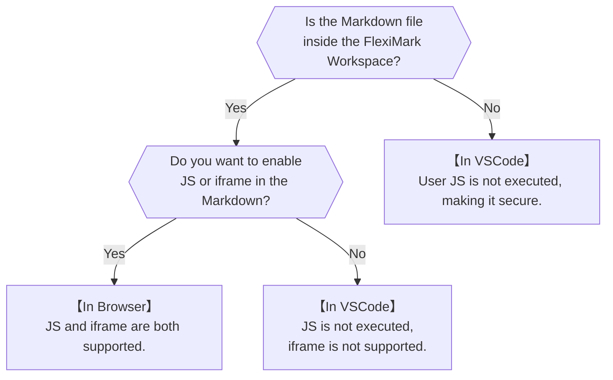

# How to Preview

You can change the preview method that is triggered when clicking the icon in the top-right corner.

## Overview

FlexiMark allows you to choose whether to preview Markdown in VSCode or in a browser. Each option has its pros and cons, so configure it according to your needs.



## How to Change

Open `.vscode/settings.json` and edit the following section. Available values are `vscode` or `browser`. Below is the default setting:

```json title=".vscode/settings.json" {3} 
{
  ...
  "fleximark.defaultPreviewMode": "vscode",
  ...
}
```