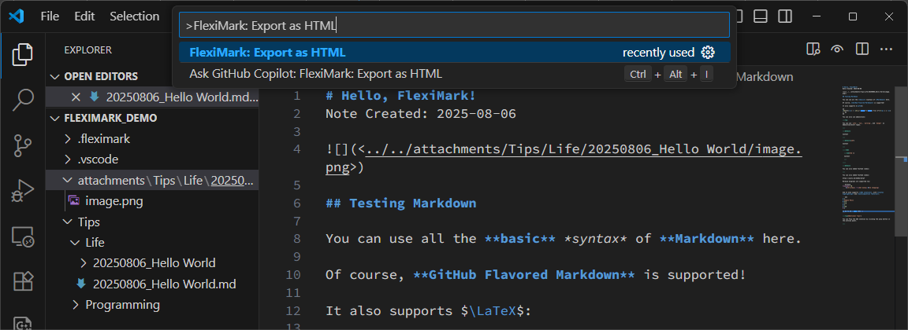
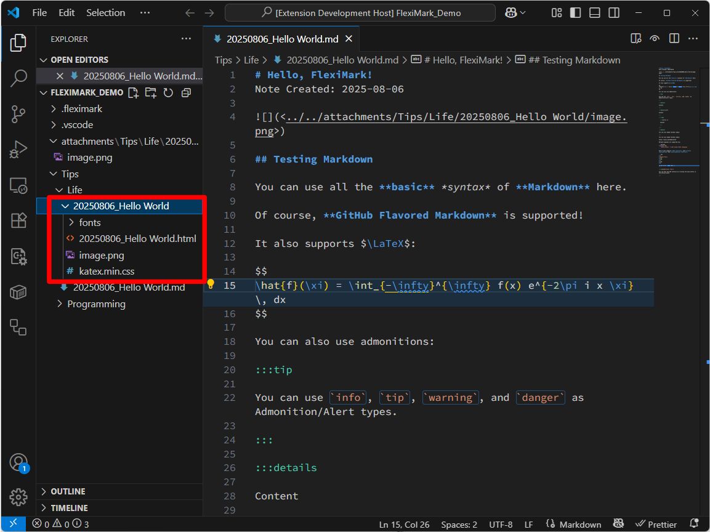

# MarkdownのHTML出力

この機能を使うと、開いているノートをHTMLファイルとして書き出せます。ノートで使用している画像やCSSなどの全てのアセットも自動で1つのフォルダにまとめられます。

## 方法

HTMLとして出力したいノートを開いた状態で`F1`キーを押下し、下記を入力してください。入力したら`Enter`キーを押してください。

```plaintext
FlexiMark: Export as HTML
```



処理が完了すると、ノートと同じ場所にノート名と同じ名前のフォルダが作成されます。\
このフォルダには、変換後のHTMLファイルと、ノートで使用しているすべてのアセットが含まれています。HTMLファイルは相対パスでアセットを参照しているため、フォルダごと移動しても正しく表示できます。


