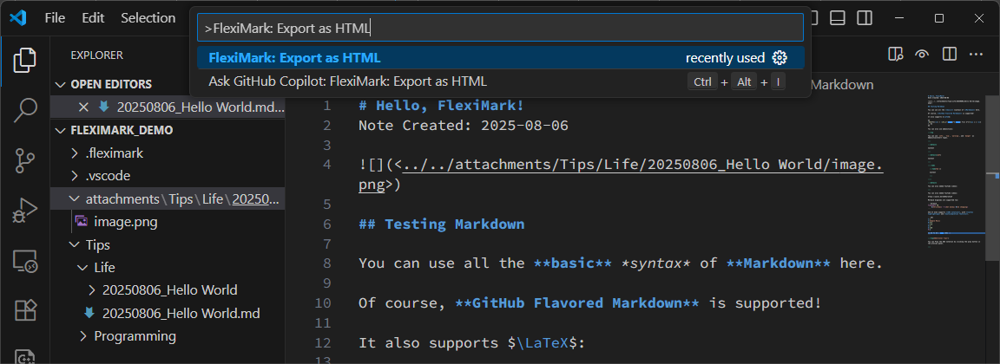
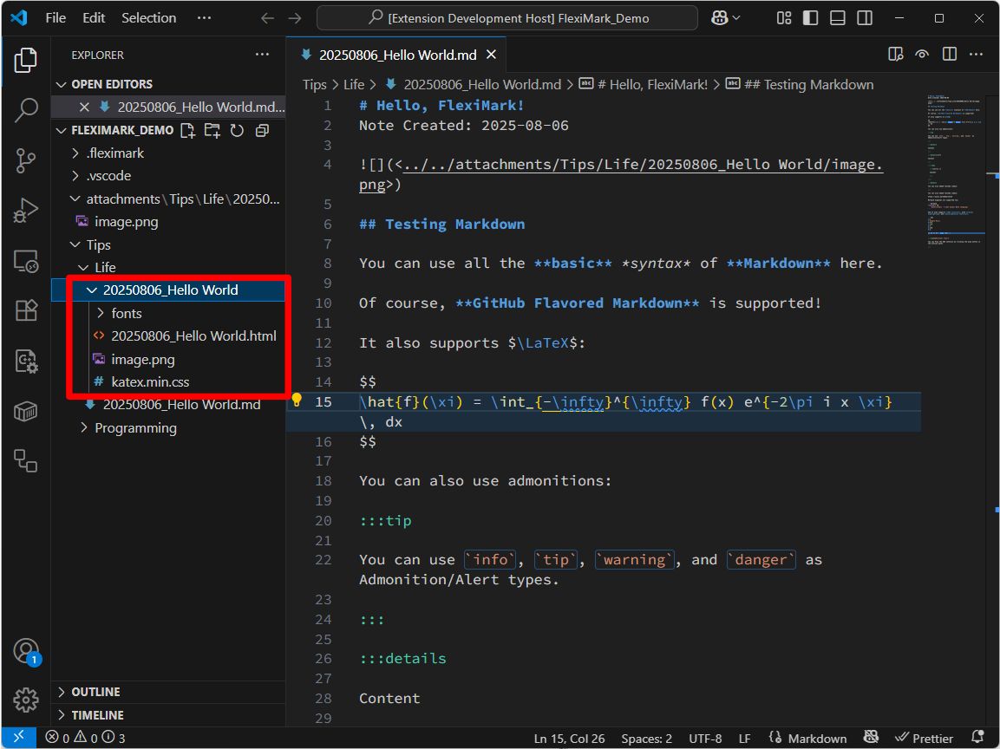

# HTML Export of Markdown

This feature allows you to export the currently open note as an HTML file. All assets used in the note, such as images and CSS, will automatically be collected into a single folder.

## How to Use

With the note you want to export open, press the `F1` key and enter the following command. Then press the `Enter` key.

```plaintext
FlexiMark: Export as HTML
```



Once the process is complete, a folder with the same name as the note will be created in the same location as the note.\
This folder will contain the converted HTML file along with all assets used in the note. Since the HTML file references assets using relative paths, it will display correctly even if the entire folder is moved.


