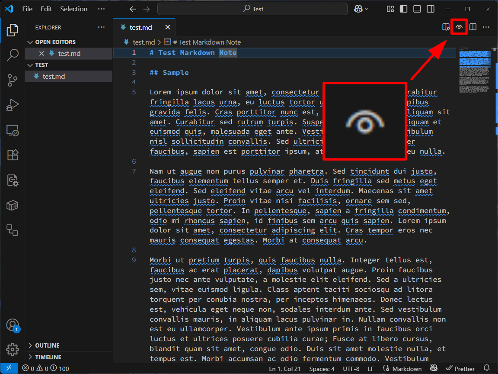
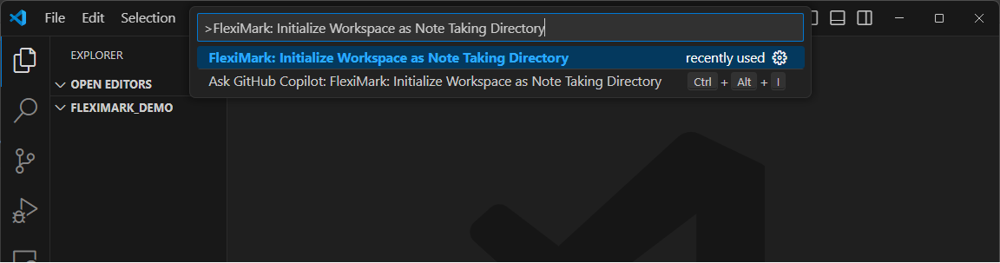
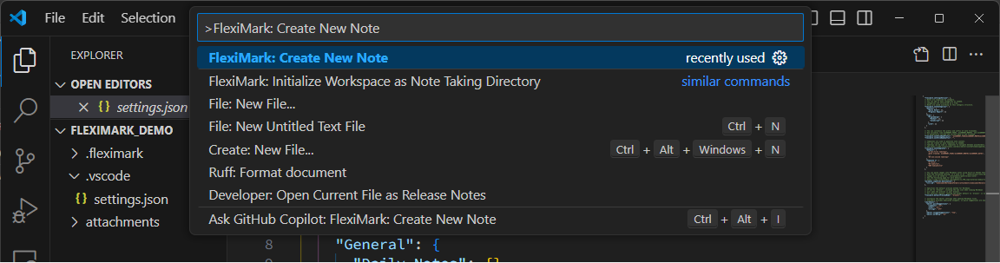
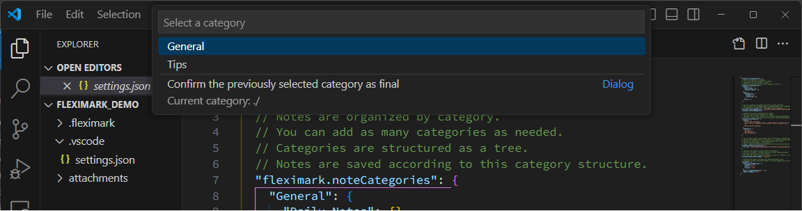
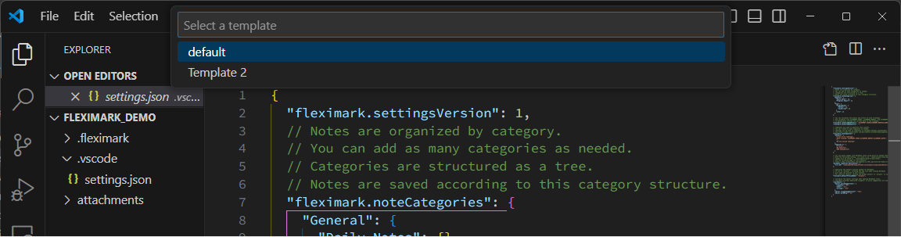
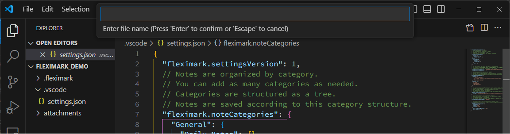
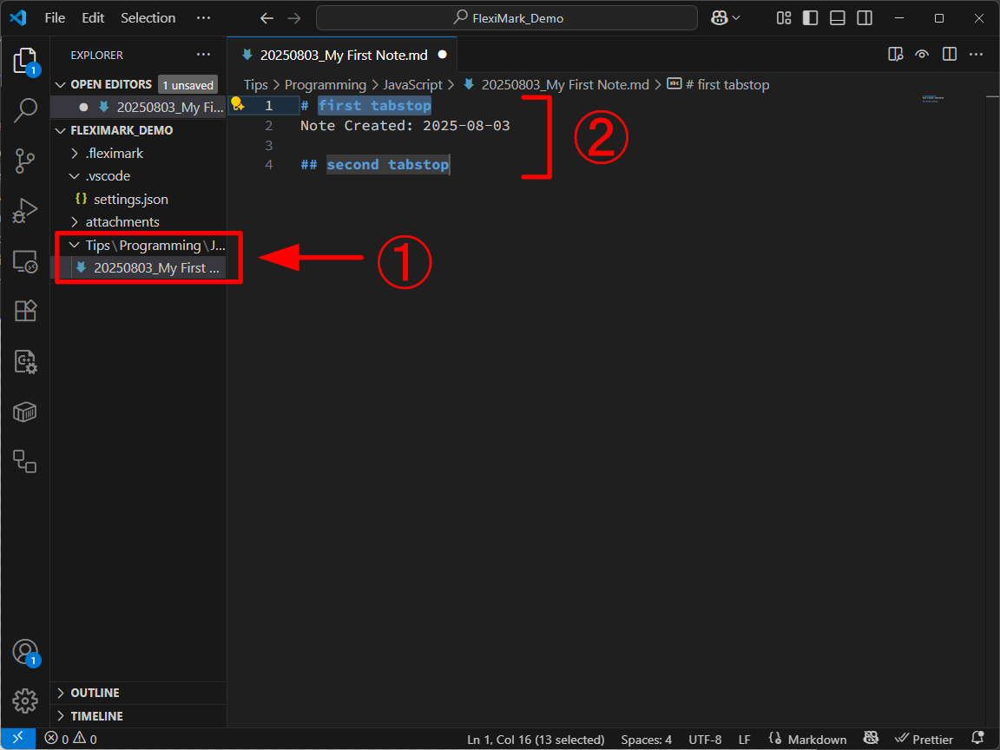

# Tutorial

## Preparation

FlexiMark is a VSCode extension. First, make sure you have VSCode installed.  
If it's not installed, you can download it from the link below:

https://code.visualstudio.com

Next, install FlexiMark. Open the link below and click the “Install” button:

https://marketplace.visualstudio.com/items?itemName=Kashiwade.fleximark

:::tip[Recommended Extensions]

To make writing Markdown easier, there are some useful extensions you might want to install alongside FlexiMark:

- [Markdown All In One](https://marketplace.visualstudio.com/items?itemName=yzhang.markdown-all-in-one)
- [Mermaid Markdown Syntax Highlighting](https://marketplace.visualstudio.com/items?itemName=bpruitt-goddard.mermaid-markdown-syntax-highlighting)

:::

## Checking Functionality

Open any Markdown file. If FlexiMark is properly installed, you’ll see an icon at the far right of the tab bar.  
Clicking this icon will open the preview.




FlexiMark’s preview feature can be used even outside of a FlexiMark Workspace.

## Creating a FlexiMark Workspace

Create a dedicated directory for FlexiMark and set it as a FlexiMark Workspace. From now on, Markdown notes will be created inside this directory/workspace.

Create an empty directory and open it in VSCode. Then press `F1` and enter the following command. Press `Enter` after typing.

```plaintext
FlexiMark: Initialize Workspace as Note Taking Directory
```


You’ll then see a screen like this. The editor will show a commented `.vscode/settings.json` file. These comments explain the various FlexiMark settings.


Let’s start by customizing the note categories. Modify the following part of `.vscode/settings.json` as you like. Double-byte characters like Japanese are supported.

```json title=".vscode/settings.json" {8-18}
{
  "fleximark.settingsVersion": 1,
  // Notes are organized by category.
  // You can add as many categories as needed.
  // Categories are structured as a tree.
  // Notes are saved according to this category structure.
  "fleximark.noteCategories": {
    "General": {
      "Daily Notes": {},
      "Progress Report": {}
    },
    "Tips": {
      "Programming": {
        "Python": {},
        "JavaScript": {}
      },
      "Life": {}
    }
  },
  ...
```

Now let’s create your very first note! Press `F1` and enter the following command. Then press `Enter`.

```plaintext
FlexiMark: Create New Note
```


A dialog will appear prompting you to select a category based on the structure you just defined.  
Use the arrow keys to choose a category and press `Enter` to move to the subcategory.  
The selection continues until you reach the final subcategory.  
If you want to stop at an intermediate level, select the bottom-most option in the dialog.



Next, you’ll be asked to choose a Markdown note template.  
By default, two sample templates are available. These can be changed in `.vscode/settings.json`.  
For now, select `default` and press `Enter`.



Finally, enter a filename for your Markdown note.  
The final file name will follow this format: `{{prefix}}{{YOUR FILE NAME}}{{suffix}}.md`,  
where the prefix and suffix are defined in `.vscode/settings.json`.



Your note has been created!  
1. Confirm that the note has been created in the selected category hierarchy.  
2. Enter any text in the `first tabstop`, then press the `Tab` key to move the cursor to the `second tabstep`.



:::info

At this point, clicking the preview button on the right side—just like before—will open the preview in your browser.  
This behavior can be customized in `.vscode/settings.json`.

:::

## Next Steps

That’s it for the initial FlexiMark setup!  
Next, head over to [Basic Usage](/docs/category/basic-usage) to learn the basics of how to use it.