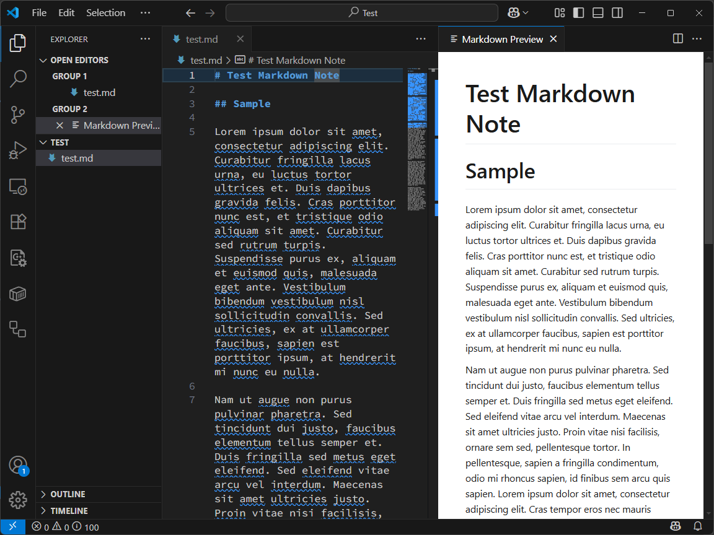
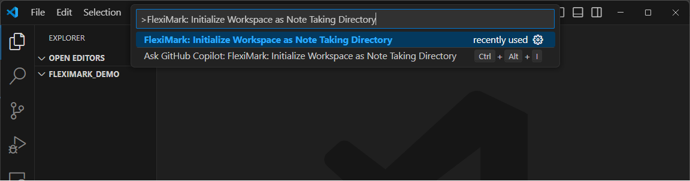
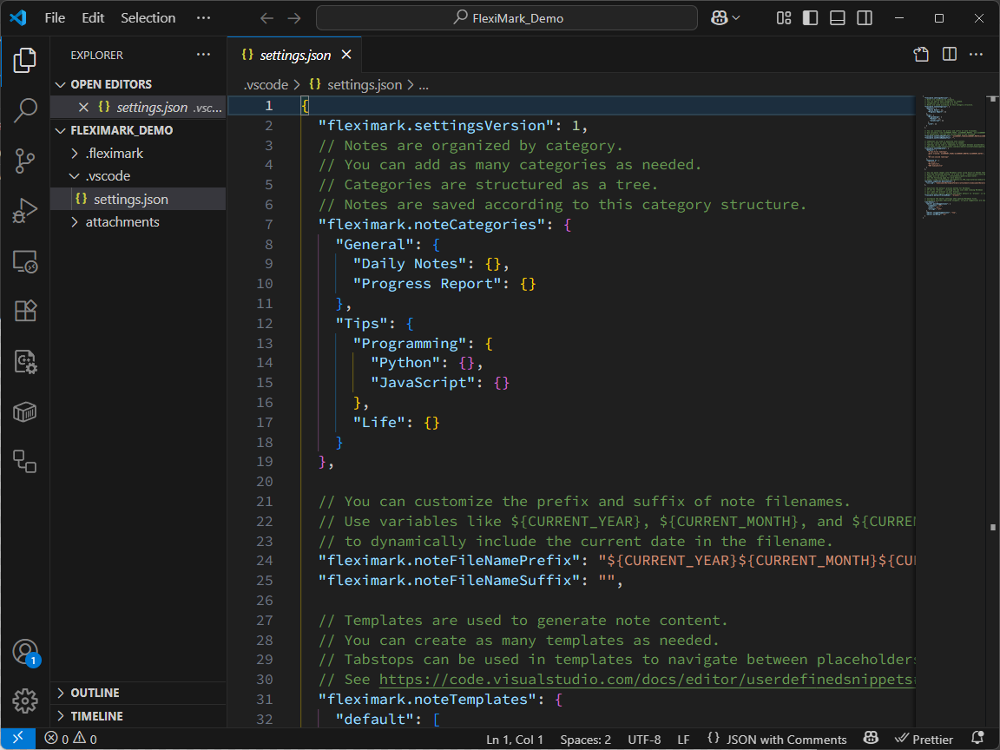
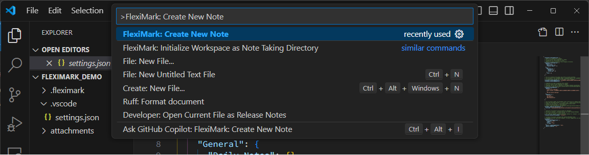
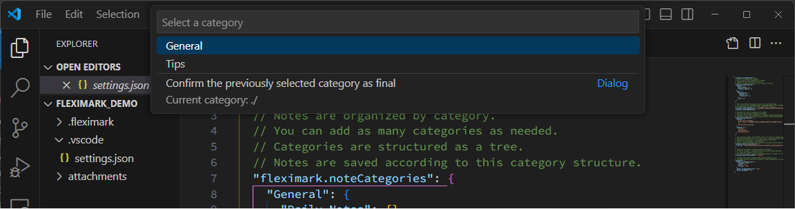
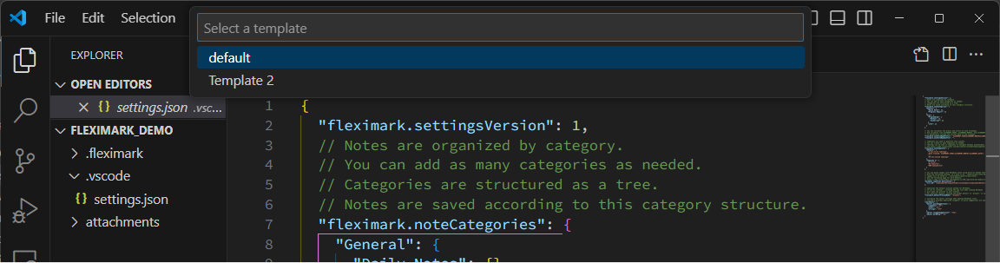
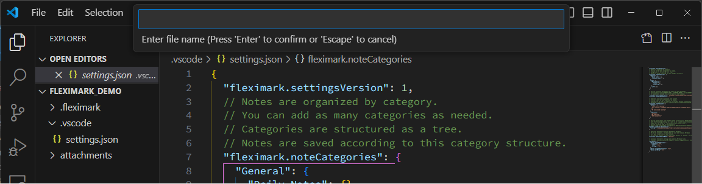

# Tutorial

## 事前準備

FlexiMarkはVSCodeの拡張機能です。まず、VSCodeがインストール済みであることを確認してください。
インストールされていない方は下記からインストールしてください。

https://code.visualstudio.com

その後、FlexiMarkをインストールします。下記のリンクを開いた後、「Install」ボタンをクリックしてください。

https://marketplace.visualstudio.com/items?itemName=Kashiwade.fleximark

:::tip[おすすめの拡張機能]

Markdownの記述をより便利にするために、いくつかのおすすめの拡張機能が存在します。併せてインストールすることを検討してください。

- [Markdown All In One](https://marketplace.visualstudio.com/items?itemName=yzhang.markdown-all-in-one)
- [Mermaid Markdown Syntax Highlighting](https://marketplace.visualstudio.com/items?itemName=bpruitt-goddard.mermaid-markdown-syntax-highlighting)

:::

## 動作確認

適当なMarkdownファイルを開いてください。FlexiMarkが正しくインストールされていれば、タブの右端にアイコンが表示されます。
そのアイコンをクリックすることでプレビューが開きます。




FlexiMarkはMarkdownのプレビュー機能は、後述するFlexiMark Workspaceの外でも使用することができます。

## FlexiMark Workspaceの作成

FlexiMark専用のディレクトリを作成し、FlexiMark Workspaceとして設定します。今後、Markdownノートの作成はこのディレクトリ/Workspace内で行います。

空のディレクトリを作成し、VSCodeで開いてください。その後 `F1`キーを押下し、下記を入力してください。入力したら`Enter`キーを押してください。
```plaintext
FlexiMark: Initialize Workspace as Note Taking Directory
```


すると下記のような画面になります。エディタにはコメント付きの`.vscode/settings.json`が表示されています。このコメントはFlexiMarkの各設定項目の説明を記しています。


まずはノートのカテゴリをカスタマイズしてみましょう。`.vscode/settings.json`の下記の部分をお好みに修正してください。日本語などの2バイト文字も可能です。

```json title=".vscode/settings.json" {8-18}
{
  "fleximark.settingsVersion": 1,
  // Notes are organized by category.
  // You can add as many categories as needed.
  // Categories are structured as a tree.
  // Notes are saved according to this category structure.
  "fleximark.noteCategories": {
    "General": {
      "Daily Notes": {},
      "Progress Report": {}
    },
    "Tips": {
      "Programming": {
        "Python": {},
        "JavaScript": {}
      },
      "Life": {}
    }
  },
  ...
```

それでは記念すべき最初のノートを作成してみましょう！`F1`キーを押下し、下記を入力してください。入力したら`Enter`キーを押してください。
```plaintext
FlexiMark: Create New Note
```


すると、先ほど設定したカテゴリ構造に基づいてカテゴリを選択するダイアログが表示されます。矢印キーで選択して`Enter`キーを押すと、その子カテゴリの選択に移ります。末端の子カテゴリの選択が完了するまで、このカテゴリ選択は続きます。途中のカテゴリで選択を終了したい場合は、ダイアログ一番下の項目を選択します。



続いて、Markdownノートのテンプレートの選択に移ります。既定では2つのサンプルを用意しています。このテンプレートは`.vscode/settings.json`で変更可能です。まずは`default`を選んで`Enter`キーを押してください。


最後に、Markdownノートのファイル名を入力します。最終的なファイル名は、`.vscode/settings.json`に設定されている接頭辞(prefix)と接尾辞(suffix)が付与されて、`{{prefix}}{{YOUR FILE NAME}}{{suffix}}.md`となります。


ノートが作成されました！
1. 指定したカテゴリ階層にノートが作成されていることを確認してください。
2. `first tabstop`の部分に任意の文字を入力したら、`Tab`キーを押すことでカーソルが`second tabstep`に移動します。


:::info

この状態で、先ほどと同じく右側のプレビューボタンを押すと、ブラウザでプレビューが開きます。この設定は`.vscode/settings.json`で変更可能です。

:::

## 次のステップ

以上でFlexiMarkの初回セットアップは終了です。続いて [Basic Usage](/docs/category/basic-usage) で基本的な使い方を紹介します。