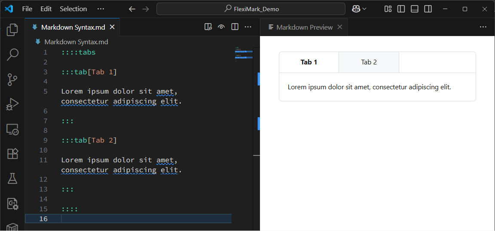
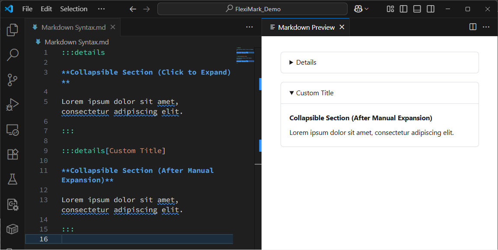
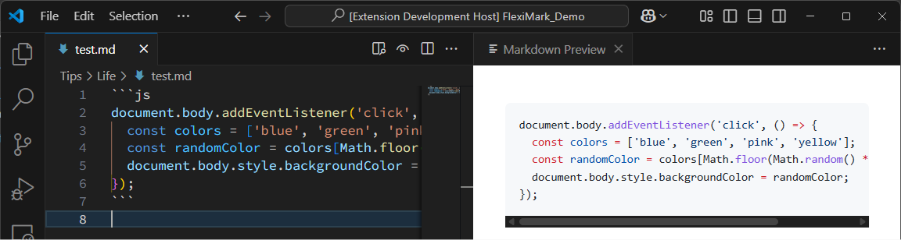
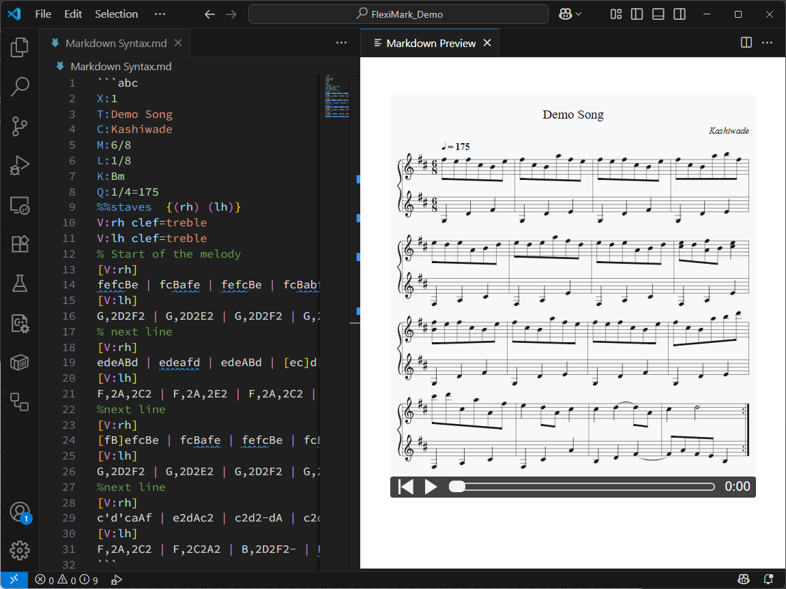

import Tabs from '@theme/Tabs';
import TabItem from '@theme/TabItem';

# Markdownの文法（拡張）

FlexiMarkがサポートするMarkdownの拡張文法を紹介します。

## 概要

FlexiMarkは[Markdownの文法（基本）](./basic-markdown-syntax.md)で扱ったものに加えて、独自の拡張記法をサポートしています。これらの記法は広くスタンダートであるとは言えませんが、日常のメモをMarkdownで記録する際に便利だと考えたため、サポートしています。

## LaTeX

[KaTeX](https://katex.org)による数式の入力を行うことができます。

```plaintext
Lorem ipsum $e^x = \sum_{n=0}^{\infty} \frac{x^n}{n!}$ sit amet, consectetur adipiscing elit.

$$
e^x = \sum_{n=0}^{\infty} \frac{x^n}{n!}
$$
```


## 付箋（Admonition/Alert）記法

[DocusaurusのAdmonitions](https://docusaurus.io/docs/markdown-features/admonitions) や [GitHubのAlert](https://docs.github.com/get-started/writing-on-github/getting-started-with-writing-and-formatting-on-github/basic-writing-and-formatting-syntax#alerts) に相当する機能です。ブロック内では各種Markdownの記法を使うことができます。また、後述する[「付箋（Admonition/Alert）の収集」](../feature/collect-admonitions.md)を用いることで、指定カテゴリ以下の全てのノートに存在する付箋（Admonition/Alert）を単一のMarkdownに収集して整理することもできます。

```plaintext
:::info

Lorem ipsum dolor sit amet, consectetur adipiscing elit.

:::

:::tip

Lorem ipsum dolor sit amet, consectetur adipiscing elit.

:::

:::warning

Lorem ipsum dolor sit amet, consectetur adipiscing elit.

:::

:::danger

Lorem ipsum dolor sit amet, consectetur adipiscing elit.

:::
```


付箋（Admonition/Alert）にカスタムタイトルをつけることもできます。タイトルには各種Markdown記法を使うことができます。

```plaintext
:::info[*Custom* ~Title~]

Lorem ipsum dolor sit amet, consectetur adipiscing elit.

:::

:::tip[*Custom* ~Title~]

Lorem ipsum dolor sit amet, consectetur adipiscing elit.

:::

:::warning[*Custom* ~Title~]

Lorem ipsum dolor sit amet, consectetur adipiscing elit.

:::

:::danger[*Custom* ~Title~]

Lorem ipsum dolor sit amet, consectetur adipiscing elit.

:::
```


:::tip

付箋（Admonition/Alert）はネストもできますが、`:`の数を変えることでペアを作る書き方がおすすめです。


:::

## タブ記法

タブを作り、内容を分けることができます。ブロック内では各種Markdownの記法を使うことができます。

```plaintext
::::tabs

:::tab[Tab 1]

Lorem ipsum dolor sit amet, consectetur adipiscing elit.

:::

:::tab[Tab 2]

Lorem ipsum dolor sit amet, consectetur adipiscing elit.

:::

::::
```



## 折り畳み

HTMLにおける`<details>`タグの代替となる記法です。カスタムタイトルをつけることもできます。

```plaintext
:::details

**Collapsible Section (Click to Expand)**

Lorem ipsum dolor sit amet, consectetur adipiscing elit.

:::

:::details[Custom Title]

**Collapsible Section (After Manual Expansion)**

Lorem ipsum dolor sit amet, consectetur adipiscing elit.

:::
```




## YouTube iframe

YouTubeのURLが1つの段落として追加された場合、自動でiframeに変換します。短縮URL以外にも対応しています。段落中にYouTubeのURLがあった場合はiframeに変換しません。

```plaintext
https://youtu.be/G1W3aroArqY

Lorem https://youtu.be/G1W3aroArqY dolor sit amet, consectetur adipiscing elit.
```


:::warning

VSCodeのプレビュー上ではiframeは正常に動作しません。iframeを動作させたい場合はブラウザプレビューを利用してください。

:::

## コードブロック

コードブロック内のシンタックスハイライトに加え、タイトル表示、行数表示、行のハイライト、単語のハイライト、差分表示に対応しています。

### 基本記法

シンプルなシンタックスハイライトは下記のように書きます。バッククォートの後に言語名（`plaintext`、`js`、`py`など）を入力してください。

````plaintext
```js
document.body.addEventListener('click', () => {
  const colors = ['blue', 'green', 'pink', 'yellow'];
  const randomColor = colors[Math.floor(Math.random() * colors.length)];
  document.body.style.backgroundColor = randomColor;
});
```
````


### タイトル

コードブロックにタイトルをつけたい場合は下記のように書きます。言語名は必須です。

````plaintext
```js title="color.js"
document.body.addEventListener('click', () => {
  const colors = ['blue', 'green', 'pink', 'yellow'];
  const randomColor = colors[Math.floor(Math.random() * colors.length)];
  document.body.style.backgroundColor = randomColor;
});
```
````


### 行番号

コードブロックに行番号を付与したい場合は下記のように書きます。言語名は必須です。

<Tabs>
  <TabItem value="シンプルな例" label="シンプルな例" default>
    ````plaintext
    ```js showLineNumbers
    document.body.addEventListener('click', () => {
      const colors = ['blue', 'green', 'pink', 'yellow'];
      const randomColor = colors[Math.floor(Math.random() * colors.length)];
      document.body.style.backgroundColor = randomColor;
    });
    ```
    ````
    
  </TabItem>
  <TabItem value="途中の番号から" label="途中の番号から">
    ````plaintext
    ```js showLineNumbers=5
    document.body.addEventListener('click', () => {
      const colors = ['blue', 'green', 'pink', 'yellow'];
      const randomColor = colors[Math.floor(Math.random() * colors.length)];
      document.body.style.backgroundColor = randomColor;
    });
    ```
    ````
    
  </TabItem>
</Tabs>

### 行のハイライト

コードブロックの特定の行をハイライトしたい場合は下記のように書きます。言語名は必須です。

<Tabs>
  <TabItem value="シンプルな例" label="シンプルな例" default>
    1行目と、3から5行目がハイライトされます。
    ````plaintext
    ```js {1,3-5}
    document.body.addEventListener('click', () => {
      const colors = ['blue', 'green', 'pink', 'yellow'];
      const randomColor = colors[Math.floor(Math.random() * colors.length)];
      document.body.style.backgroundColor = randomColor;
    });
    ```
    ````
    
  </TabItem>
  <TabItem value="コード内で指定" label="コード内で指定">
    `[!code highlight]`をコメントとして記述することでもハイライトできます。同様に、1行目と、3から5行目がハイライトされます。
    ````plaintext
    ```js
    // [!code highlight]
    document.body.addEventListener('click', () => {
      const colors = ['blue', 'green', 'pink', 'yellow'];
      // [!code highlight:3]
      const randomColor = colors[Math.floor(Math.random() * colors.length)];
      document.body.style.backgroundColor = randomColor;
    });
    ```
    ````
    
  </TabItem>
</Tabs>

### 差分のハイライト

コードブロックの特定の行を差分表示のようにハイライトしたい場合は`[!code --]`や`[!code ++]`をコメントとして書きます。言語名は必須です。

<Tabs>
  <TabItem value="シンプルな例" label="シンプルな例" default>
    ````plaintext
    ```js title="color.js"
    document.body.addEventListener('click', () => {
      // [!code --]
      const colors = ['blue', 'green', 'pink', 'yellow'];
      // [!code ++:7]
      const colors = [
        'blue', 
        'green', 
        'pink', 
        'yellow', 
        'red'
      ];
      const randomColor = colors[Math.floor(Math.random() * colors.length)];
      document.body.style.backgroundColor = randomColor;
    });
    ```
    ````
    
  </TabItem>
  <TabItem value="行表示と組み合わせた例" label="行表示と組み合わせた例">
    ````plaintext
    ```js title="color.js" showLineNumbers
    document.body.addEventListener('click', () => {
      // [!code --]
      const colors = ['blue', 'green', 'pink', 'yellow'];
      // [!code ++:7]
      const colors = [
        'blue', 
        'green', 
        'pink', 
        'yellow', 
        'red'
      ];
      const randomColor = colors[Math.floor(Math.random() * colors.length)];
      document.body.style.backgroundColor = randomColor;
    });
    ```
    ````
    
  </TabItem>
</Tabs>

### 単語のハイライト

コードブロックの特定の単語をハイライト表示できます。

````plaintext
```js title="color.js" /colors/
document.body.addEventListener('click', () => {
  const colors = ['blue', 'green', 'pink', 'yellow'];
  const randomColor = colors[Math.floor(Math.random() * colors.length)];
  document.body.style.backgroundColor = randomColor;
});
```
````


## Mermaid

[Mermaid](https://mermaid.js.org)による各種ダイアグラム描画を行うことができます。

````plaintext

````


:::tip

Mermaidのシンタックスハイライトには下記の拡張機能を別途インストールするのがおすすめです。

- [Mermaid Markdown Syntax Highlighting](https://marketplace.visualstudio.com/items?itemName=bpruitt-goddard.mermaid-markdown-syntax-highlighting)

:::

## ABC記譜法

[ABC記譜法](https://abcnotation.com)に対応し、楽譜を書くことができます。また、シンタックスハイライト、各種スニペット、楽譜の再生、カーソル編集位置の表示などにも対応しています。

````plaintext
```abc
X:1
T:Demo Song
C:Kashiwade
M:6/8
L:1/8
K:Bm
Q:1/4=175
%%staves  {(rh) (lh)}
V:rh clef=treble 
V:lh clef=treble
% Start of the melody
[V:rh]
fefcBe | fcBafe | fefcBe | fcBabf |
[V:lh]
G,2D2F2 | G,2D2E2 | G,2D2F2 | G,2D2E2 |
% next line
[V:rh]
edeABd | edeafd | edeABd | [ec]d[fA]B[ec]2 |
[V:lh]
F,2A,2C2 | F,2A,2E2 | F,2A,2C2 | F,2A,2E2 |
%next line
[V:rh]
[fB]efcBe | fcBafe | fefcBe | fcBabd' |
[V:lh]
G,2D2F2 | G,2D2E2 | G,2D2F2 | G,2D2E2 |
%next line
[V:rh]
c'd'caAf | e2dAc2 | c2d2-dA | c2d4 :|
[V:lh]
F,2A,2C2 | F,2C2A2 | B,2D2F2- | FAFEB,2 :|
```
````



ABCのコードブロック内でバックスラッシュ（`\`）を入力することで、ABC記譜法のスニペットが表示されます。


また、ABCのコードブロック内でエクスクラメーションマーク（`!`）を入力することで、各種記号のスニペットが表示されます。
