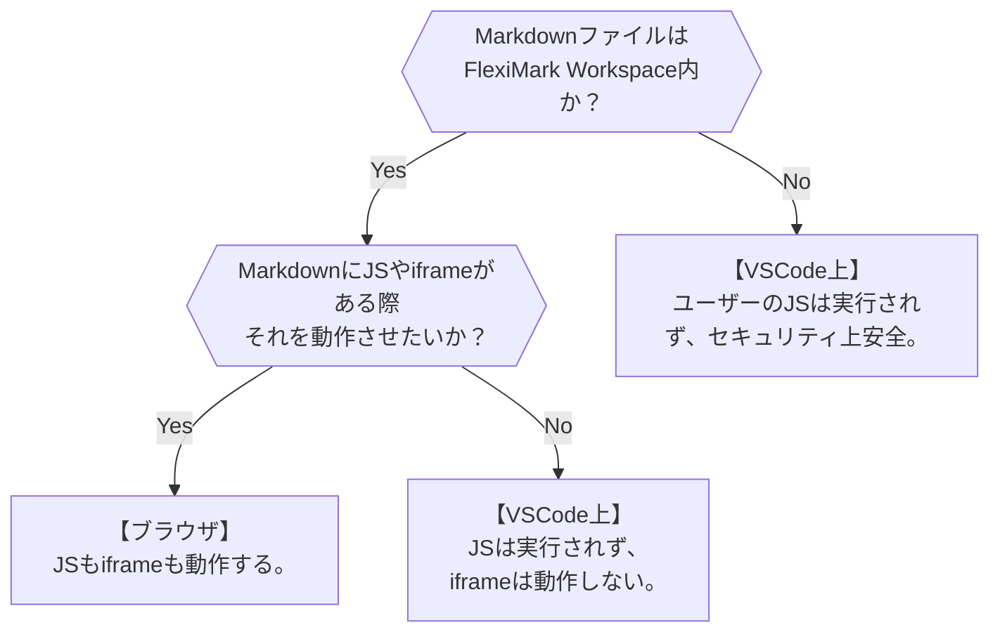

# プレビューの方法

右上のアイコンをクリックしたときのプレビュー方法を変更できます。

## 概要

FlexiMarkではMarkdownのプレビューをVSCode上とブラウザのどちらで行うのか選択できます。どちらも一長一短なので、用途に合わせて設定してください。



## 変更方法

`.vscode/settings.json`を開き、下記の部分を修正してください。取り得る値は`vscode`か`browser`です。下記はデフォルトの設定です。
```json title=".vscode/settings.json" {3} 
{
  ...
  "fleximark.defaultPreviewMode": "vscode",
  ...
}
```