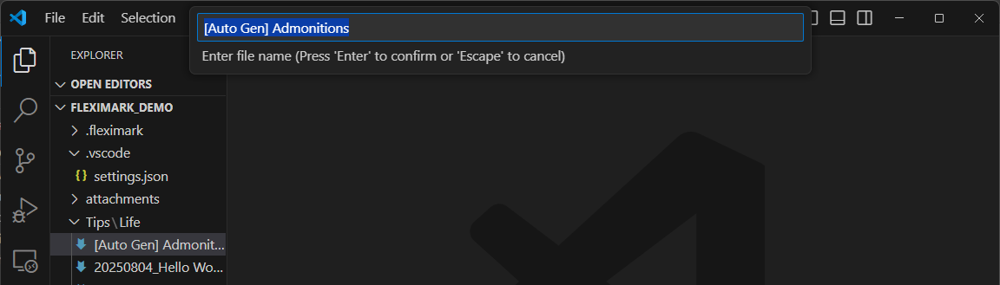

# 付箋（Admonition/Alert）の収集

この機能は、指定したカテゴリ以下にある全てのノートから、[付箋（Adomonition/Alert）記法](../basics/extended-markdown-syntax.md#付箋admonitionalert記法)で書かれたメモや注意書きを自動的に抽出し、1つのMarkdownファイルにまとめるものです。これにより、複数のノートに分散している重要な情報を、カテゴリ単位で一覧・整理できるようになります。

たとえば、「数学」カテゴリの下に複数の学習ノートがあり、それぞれのノートに自分のつまずきポイントを付箋形式で記録していた場合、それらの付箋だけをまとめて抽出し、「数学のつまずきメモ集」として再利用することが可能です。復習や情報の見直しに役立ちます。


## 操作方法

FlexiMark WorkspaceをVSCodeで開いた状態で、その後 `F1`キーを押下し、下記を入力してください。入力したら`Enter`キーを押してください。
```plaintext
FlexiMark: Collect admonitions/alerts and compile them into a single Markdown file
```


続いてカテゴリ選択ダイアログが表示されます。収集したいノートが含まれるカテゴリを選択してください。\
途中のカテゴリを選択したい場合は、ダイアログ一番下の項目を選択します。


最後に、付箋（Admonition/Alert）記法を収集して記録するノートのファイル名を入力します。

:::warning

このファイル名に接頭辞(prefix)と接尾辞(suffix)は付与されません。

:::

収集が完了します。

